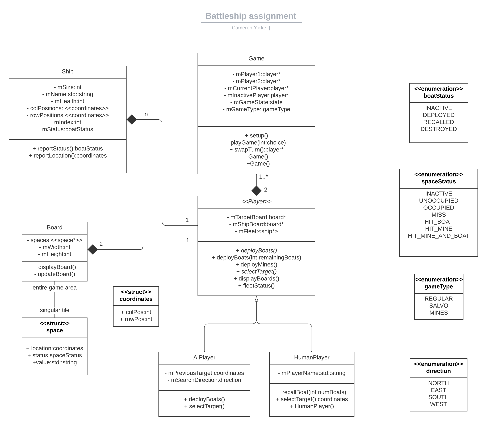
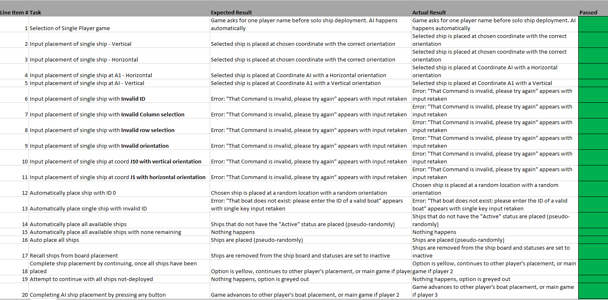
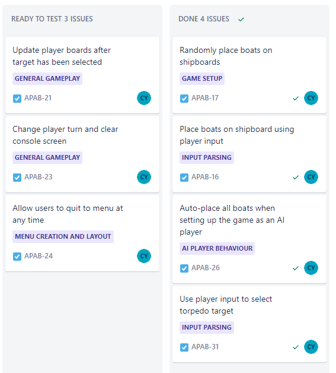
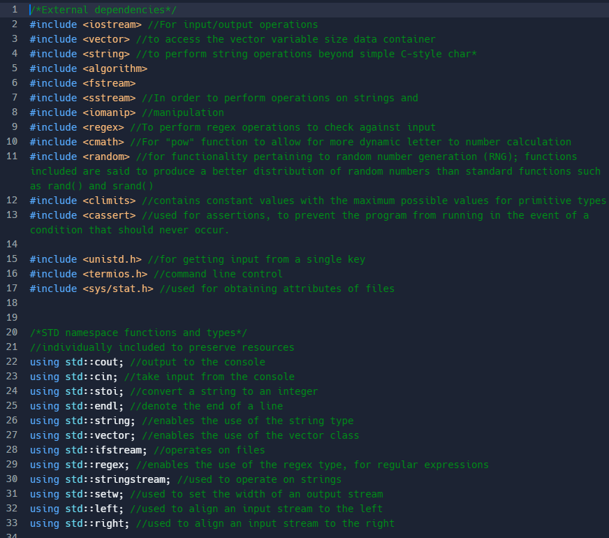
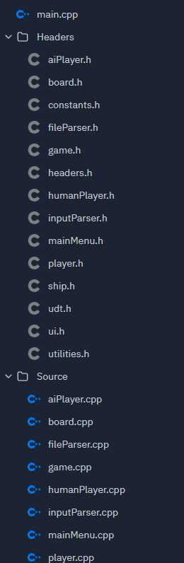
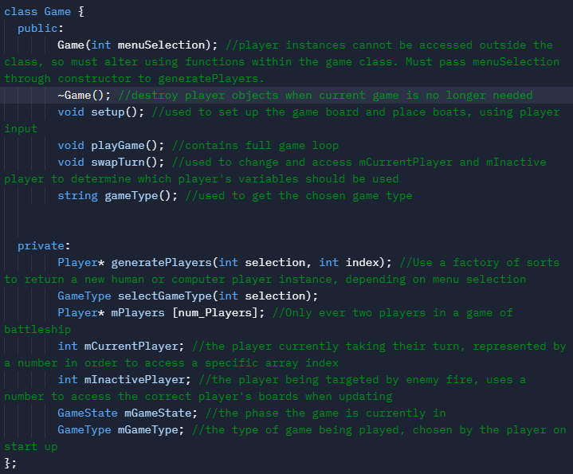

## Challenge Outline (academic standard: pass level detail: section required for pass) – 10%
### a. Summary and review of the problem, overall proposed solution.
The problem I decided to tackle for my project was that of the game Battleship. (named adaship for the sake of this assignment) The game itself features two opposing players attempting to guess the placements of boats of varying sizes on one of two game boards while recording their guesses on another. Successful guesses are marked as hits on both the "ship" and "target" boards, while unsuccessful ones marked as misses on the target board of the current player. The game ends when all of a player's ships have been "destroyed" by idenifying their locations. 

Battleship is typically played with board game apparatus, phyiscal pieces with a pinholed board. It can also be played using pen and paper. This disconnect between a strongly physical method of play proves the concept for its transition to other mediums. The project itself attempted to recreate battleship in a command line computer terminal interface, using the C++ programming language. In addition, I made attempts to expand upon the base game by including an additional game mode, as well as a variety of options for gameplay, such as AI opponents, Player Vs Player games and AI only games. 

From the inception of the project, there were already a substantial amount of additional aspects to consider, beyond the scope of a physical game. These considerations included having to manage Players within the game and their associated data, as well as turn order and handling. 

Previously physical aspects of the game were required to be represented visually, such as boards and boats. Both of which needed to be managed in such a way that physical "space" was constitued as locations made up of underlying data structures. This necessitated the need for graphics and rigourous output manipulation to represent these aspects accurately. In addition, tasks which make up the component phases of the game, such as boat placement onto player boards, and the firing of rockets on player turns demanded a procedural and much more manual approach far removed from simply placing a peg in a hole or writing a symbol on a grid by hand. The logic for this, of course, was to be programmed into my project by way of taking and appropriately handling player input. This presents its own set of problems as the coordinate space within battleship is denoted by a "letter number" format, with the Y axis travelling down. The solution to this was to include some form of number to letter conversion. In the case of an AI player, they would be required to act independently, without player input guiding their direct decision making. 

The lack of a physical play area, restricted as such due to the nature of a command line console, also meant that the visual and logical parts of the game were naturally separated. As such, the physical aspects of the game were be tracked meticulously in order to avoid a disconnect between the visual and logical parts of the game.

Details such as the size of the board and information of the ships as part of the game were to be included in an external file that data would be read from. 

Overall, there were many other characteristics to consider beyond the rules and concepts that make up the battleship game itself. How I utilised, grouped and manipulated data, how my algorithms were presented and how logic flowed throughout my project were all strong considerations that I took great care in designing and evaluating as I continued my development. 


### b. UML style diagram illustrating initial overall solution (linked to 1a)

 

The UML diagram, found above, represents the initial design of my system, including the classes and objects found within, and their relationships with one another. The classes themselves (and by extention their relationships) did not change in my final program, nor were any additional ones added, but the data within them, such as variables and functions changed significantly in my final implementation. Various enumerated types were also included. Some concepts within, such as the AI player classes' "mPreviousTarget" and "mSearchDirection" went unused and were ultimately removed in the final version of my system.

Some aspects of this initial design misinterpreted and misunderstood how levels of abstraction and access modifiers work within C++, as well as the intricaies of run-time polymorphism in the language. For example, the recallBoat function, found only in the human player class would not be callable from parts outside of the HumanPlayer class in the design shown above. In order for the initial design to work, the function would also need to be present in the base class and in the AIPlayer class as well, since the player type represented in the "Game" class were base class pointers. In my final implementation, this function was moved to the main game class, in order to avoid any redundant code.

My initial problem design diagram did not include utility functions and overall globally used functions that were not tied to an object. However, these were considered alongside objects when conceptualising my program. 

### c. Initial working plan, overall approach, development strategy and approach to quality (linked to 1a,1b).

My initial working plan was to actively define the systems my action was going to take, breaking down various tasks from the overall proposed solution. I then initially tackled various tasks that were identified to be independent from any object, such as input and file parsing functions, before constructing the objects and user-defined types outlined in my UML that made up the component parts of my game, which was followed by defining the logic that encompassed the game itself.

The overall approach that I took was to tackle no more than 4 related tasks at any given time which were tracked via the Jira board I made for the project. This allowed me to work in an agile way and encouraged a regular review of the status of the tasks I was actively working on.  While I wasn’t able to work in a sprint or scrum style due to time constraints, I did reflect on the tasks I was managing and moved tasks between my defined swim lanes on a regular basis according to their status. As the project progressed, this approach became more difficult as more complex “smaller” tasks contained a number of smaller tasks that were harder to track, especially when these tasks promoted major refactoring or restructuring of my code. I made attempts throughout to “future proof” my code for later phases of development in order to mitigate this in advance, so not to take up valuable development time. 

My approach to quality and development strategy consisted of a regular testing strategy as features and milestones were being developed, which ensured that I failed often and made effective attempts to resolve any issues. I also consistently refactored my code as the project progressed which improved its readability, and in some cases, the logic and flow. This included extracting functionality from parts of the program and placing them in their own functions, renaming variables and overall improving logic flow. I also followed various tried and tested design patterns such as abstract factories and finite state machines in my solution to provide solid bases from which to further implement my functionality and maintain an object-oriented development strategy.


### d. Analysis and decomposition of the overall problem into key ‘epic’ style tasks (linked to 1b, 1c).
In order to effectively develop the application portion of my project, I made sure during the planning and preparation phases, to analyse the overall task at hand and decompose aspects of game into “epic” style tasks. 
These would later be broken down into more specific tasks.
Per the assignment brief, this included general gameplay considerations for the base battleship game, in addition to game modes that would be potentially implemented in later development phases, such as the “salvo” and hidden mines game modes. 
There were also a number of wider considerations which comprised of problems that I identified before overall development began, namely menu creation & layout, input parsing, and file management. These were issues that I believed would take up a considerable amount of development time and resources, as well as being integral to the functionality of the game itself.  As such, these issues deserved their own “epics” to group sub-tasks under and were tracked alongside other wider issues. 

I also included the setup phase of the battleship game as its own “epic” for similar reasons. As identified in section 1A of this report, there are aspects of the battleship game that become more convoluted and involved when the physical mediums of the game are taken away. Add to this fact that extra, computer game only functionality needed to be added on top, such as auto-placing boats during the setup phase, resulted in the “game setup” being allocated its own high-level task. 

The final two “epics” I incorporated were related to the behaviour and logic behind the two inherited and derived classes of the player object, Human and AI players. Similar to the setup phase, the concept of a player for use in the command line console adaptation of battleship is much more complex than it is for the physical game. Not only are human players allowed to manually place ships much like they do in the physical game, but can also do so automatically with a randomised location. The assignment brief specifically calls for auto placement of a single boat, available boats (i.e. those not already placed, and all boats, which each come with their own challenges. The same applies to an AI player, which is a fresh consideration for the adapted game. While their decision making and mechanical navigation of the game is much more pre-determined, extra care needed to be taken to ensure an AI player is bound to the same rules as a human one. 

I made use of the issue tracking software “Jira” to consider high level tasks and concepts, visualise progress through swimlanes and categorise tasks under “epics”.


### e. Initial object-oriented design ideas and planned phased breakdown into smaller tasks (linked to 1d).

As part of my initial design, I considered various object-oriented design ideas in order to make use of them effectively within my program. This came as part of breaking down tasks into epics and developing my UML diagram, with various objects and concepts in mind.

The design first idea I contemplated was that of Polymorphism, a key object orientation paradigm that promotes re-use and dynamic processing of data. The type of polymorphism I focussed on was that of run-time polymorphism, which I believed would be well suited to the different game types on offer, due to their similar implementations with ultimately different attributes. However, upon reflection, the unique aspects of each of these game modes, such as multiple rockets for a salvo game mode and hidden mines for its game mode, did not set each of the game modes apart enough to justify developing these in this way. The fundamental behaviour and game flow would not change significantly enough in each game mode to warrant such a significant design decision that could simply be represented as extra parameters or conditional statements.

Per the mechanics of the game however, I identified that that actions of the player in many cases came in different varieties. For example, for a player to place a boat, they could either choose to do so manually or automatically. Even within automatic placement lies variances in the way in which it can be applied, according to the requirements outlined in the assignment brief. This exemplified how the player class (and its eventual subclasses) lent itself well to the concept of polymorphism, which made its way into my class in the form of runtime and compile time polymorphism. 

Identified quite early on in my initial designs, the object-oriented concept of composition was applied to my identified game class, in which I recognised that a game of battleship cannot exist unless it consists of two players. This line of thinking also inspired my usage of polymorphism and my derived player classes.
Initially in my designs, I tried to make all member variables “private” to maintain a strong level of encapsulation and to not disclose the values which belong to a class without a strong rationale for programming purposes or where it did not make sense in the context of the game. This was ultimately changed in cases where variables needed to be accessed, mainly in the Player class and its derived classes, where encapsulation was conserved through the “protected” access modifier. 

Classes themselves were easily identifiable as objects that belonged to the physical game of battleship. This lent itself well to the object-oriented methods I employed throughout the project. 

Over the course of my project, at regular intervals I broke various tasks that I had previously identified down into their smaller, component parts in order to track the progress made throughout and to identify which actions to take based on these smaller individual tasks. This was phased in the sense that each “epic” needed to be divided into actionable tasks and each of those tasks had specific steps and solutions. For example, the epic for the “Salvo Game” could be broken down into allowing the firing of multiple torpedoes, which can be further broken down into amending input parsing to allow for multiple targets and so on. 
The action of identifying tasks was initially done using the physical battleship game as a reference point, especially when considering “epics” and high level tasks. I later had to adapt my thinking to a programming perspective in order to suit the needs of object-oriented ideas such as encapsulation and abstraction. For example a task that describes “displaying the game boards” required the data from the board classes to be passed to the player class, which in itself was a component task in my implementation.

I found the initial and intermediate stages of breaking down tasks to be quite easy in the sense that it broke down a concept into a bigger picture, but as sub-tasks became targeted and specific, I found myself skipping key steps when identifying component tasks. This was especially true when attempting to future proof aspects of my code for expanded developments to increase my project’s complexity.


----

## 2. Development (academic standard: merit level detail: section required for merit) – 15%
### a. Adoption and use of ‘good’ standards (linked to 1a, 1b, 1c).

As part of my development strategy, I adopted and utilised a number of "good" programming standards that contributed to my code being readable and logical, in addition to encouraging good habits from the perspective of the programmer. This section will discuss the standard I personally adopted.

The first of these was adopting good quality, jargon free comments, so that the purpose of my code could be understood by all who read it. Where possible, I avoided using programming specific terms and attempted to keep comments within the context of the battleship game itself, unless the inclusion of these terms is vital to assist in understanding a given code block's purpose. An example of this is below:
```
int ui_displayBoatPlacement() 
{
  //don't clear screen, we need board to be displayed 
  cout << endl << manual_Boat_Selection << endl //manually place ship
  << auto_Boat_Selection << endl //auto place ship
  << auto_Place_Remaining << endl //auto place boats with an "inactive" state
  << auto_Place_All << endl //auto place all boats
  << reset_Boats << endl //recall all boats
  << complete_Setup << endl << endl //complete setup and continue
  << exit_text << endl << endl << endl; //exit

  return stoi(getLineSingleKey(regex_Menu_Selection, invalid_Menu_Input)); //take input, return as integer
}
```

I also attempted to minimise any code block duplication, which contributes overall to readability and avoids redundancy. I achieved this in many instances by taking the code in question and refactoring/placing it into its own function, where applicable. Below is a before and after comparison from an old version of my file parser function, with numerous repetitions, and the current version respectively:

##### Before
```
if(line.find('x')) {
	getline(configFile, line, 'x');
} else {
	getline(configFile, line, 'X');
}

removeLeadTrailSpaces(line);
boardWidth = stoi(line);

getline(configFile, line);
removeLeadTrailSpaces(line);
boardHeight = stoi(line);
```
##### After
```
if(line.find('x')) { //look for a lower case 
          delim = 'x';
        } else { //just in case the board has an upper case x
          delim = 'X';
        }
        getline(configFile, line);
        
        parameters = extractFileParameters(line, delim);
        
        boardWidth = stoi(removeLeadTrailSpaces(parameters[0]));
        boardHeight = stoi(removeLeadTrailSpaces(parameters[1]));
 ```


My naming convention follows some of Stroustrup's recommendations including avoiding capitalising the first letters of variables names (to differentiate them from C++'s built in types and avoiding full capitalisation to prevent clashes with Macros, which, admitedly, go unused in my code.

Following these principles, I also made use of enumerated classes to prevent unwanted type conversion for my state enums. 

One aspect of the "good" standards I always pay close attention to are the naming conventions I used for my variables, functions and objects. I do so in order to provide contextual value at first glance so that different aspects can be identified easily. For this project I used the following conventions: for all variables and function names, I used camel casing as it is my preferred method for standard code identifiers. Classes and user defined types (structs, enums) are defined with capital first letters to differentiate them from C++'s built in types. Class member variables begin with an "m" prefix, which I do not apply to structs in order to enable differentiation between them. Finally, any constant values follow camel casing with underscores between words, this is to make them stand out and be immediately identifiable next to variables.  This naming convention follows some of Bjarn Stroustrup's recommendations including avoiding capitalising the first letters of variables names (to differentiate them from types (C++'s own and my user defined ones) and avoiding full capitalisation to prevent clashes with Macros, which, admitedly, go unused in my code.

(Stroustrup, 2019) recommends that his rules should be used as a guideline only if there are no solid standards to adhere to or if the developer has no better ideas. With that in mind, I adapted some of his standards and applied some of my own preferences to create the programming style which I attempted to consistently follow throughout the project.  

The next set of standards are related to indentation, spacing, and alignment.

When indenting my code, I always used a singular tab inward from the latest control statement or definition. This because it was easily replicable and simple to follow. It also helped to conserve horizontal space, which, in the context of the editor I was required to use for this project, Replit, meant that less lines of code would be visually pushed to the next line in the IDE despite functionally existing on the same line, overall improving readability in this case. I also logically grouped statements together within code blocks using similar types or purpose as grouping blocks. This not only made my code more readable, but enabled me to identify how deep certain groups of code were nested, which would pinpoint an area to improve when refactoring. Blocks were also separated by only a sigle carriage return, to save on vertical space while clearly denoting the edge of a logical group of statements. 

I once again looked to Stroustrups recommendations for the alignment of braces to denote the beginning and end of code blocks. In my code, opening braces are placed on the same line as a logical control statement, loop or class definition, but not when implementing a function. This is to help distinguish between each of the types of blocks above, but especially between class and function definitions. This style also conserves vertical space more efficiently than other similar layout style variants (Stroustrup, 2019). In this form, the indentation style varient is named "Stroustrup".

I also made efforts to use space consistently to separate operators and delimiters, although the same style was not applied to both. Operators were included a space either side, whereas delimiters were placed directly next to a name or statement and followed by a single space. This was done in such as way to mimic application of these symbols outside of a programming context, such as for arithmatic in the case of operators. 

In my code, I made a conscious decision to attempt to avoid deep nested conditionals. What is considered as such is widely debated, with some believing that conditionals themselves are a code smell (Nagarajan, 2020). I made use of various conditionals such as if, else statements and switch/case blocks in addition to loops that introduced levels of nesting. On the whole, I believe this was mostly adhered to. This benefitted my code as it made it considerably more readable, easy to maintain and made more logical sense.

The only instance of an arguably deep level of nesting is within my acknowledgeShot function, in which a nested if-statements sits within a double nested loop which is needed in order to access a vector member variable within an instance of the Ship class, of which, all instances are stored within a vector. 

Within this function I took reasonable actions to prevent further nesting by including guard clauses that return from the function early if their conditions are met. In previous versions, this was a considerably deeper nested conditional chain. I believe that this function in its current form makes logical sense, and could not be much further removed from its current level of nesting due to the loops that encompass it. In addition, the if-statements within attempt to return from the function at the earliest possible opportunity.

All of the variables within my code had reasonable scopes and lifetimes according to their purpose. This was to prevent unwanted and untraceable behaviour due to the application of non-constant global variables. All of the variables I utilised had specific scopes and lifetimes according to the logic of the game. The exception to these are my global constants, the majority of which are comprised of strings containing UI elements, error messages, prompts, special characters and a file name. These strings were implemented in this way to reduce the space in my main program taken up by string literals. Some string literals do remain within my program, but these act as fragments of larger strings rather than entire literal values. 

Other global constants include regular expression patterns and integer values that act as single points of truth, such as the number of players, boards and indexes of specific gameplay boards within the “mPlayerBoards array that belongs to each player. These integer values were defined as constants to mitigate the reuse of “magic” literal values within my code that provided no context to their purpose.

My constants were also assigned the “inline” keyword. This results in their values being evaluated at compile time and prevents the redefinition of variables across multiple files. This in turn conserves system resources, as an inline constant is defined once regardless of how many code files it is included in. Normally, this would result in as many definitions as there are files. 

I made other efforts elsewhere in my program in order to conserve system resources, as well. The header files used within my program included the “pragma once” preprocessor directive to also only be included once at compile time. This prevented further redefinitions beyond the scope of primitive types, but for the entirety of my program. This has the advantage of including exponentially less code to be considered, which can result in an improved compilation speed. Furthermore, adopting this method can help to avoid name clashes and multiple definitions, which can cause unexpected behaviour, or worse, prevent the program from running. I also saved on system resources by including functions and classes from the C++ Standard Library namespace (std)  individually, rather than including the entirety of the namespace, the majority of which would go unused, and in a worst case scenario potentially cause clashes with my defined types and variables. I chose this method over including the “std::” prefix each time to save on horizontal space (albeit a small amount), to make my code more readable to, and prevent unnecessary repetition.  

It could be argued that my use of pointers within my Game class is antithetical to my assertion that I adhered to the aforementioned standard of conserving system resources, as the direct allocation of memory could lead to memory leaks, however, I took every precaution within my program to delete the dynamic memory allocated once the Game class was out of scope. Likewise, In terms of memory footprint, the player class did not take up a large amount of memory. The instantiation of the Player class required in order to play a battleship game, a total of two also meant that the level of memory being used by these objects was predictable, and assured in advance.

Also within my program, I attempted to keep forced type conversion, coercion or casting to a minimum. This was mainly to prevent a loss of data, and because a wide reliance on casting and conversion is seen as a bad practice that suggests that a programmer does not know what types their program should consist of. While I did not explicitly cast any values, I did make use of the stoi (string to integer) function included in the C++ Standard Library, which was required in order convert player input strings into values for the game and its underlying data structures. I also included integers within stringstreams for similar purposes, namely outputtng the column label values as letters for the player boards.

Moreover, some types in C++, such as Char, are integral types, which means that it is stored as an integer. I made use of this feature to also convert numbers to letters, and vice versa. Because of the fact that the game interprets Char values as numbers and their equivalent ASCII values, I did not need to cast integer values in order for them to be evaluated and utilised as characters.

Finally, I established a rigorous testing strategy throughout development by testing at regular intervals and by testing various features in isolation, which allowed me to discover what worked and what didn't before it was integrated fully into my program. This fail fast approach encouraged me to explore the limits of my code within a given context in order to meet requirements. In addition, developing various features asynchronously from my main program enabled me to begin testing effectively earlier than if I focussed on building my program from the ground up, as the class based structure of my program would require my program to be implemented beyond the point at which my objects could be instantiated. By testing features during development, and posthumously at assigned intervals between development phases, I was able to evolve my code and resolve any issues effectively. This was also beneficial for future proofing my code and enabling further developments.

### b. Phase 1 development: tasks, code review and changes (linked to 1d,1e).

##### Tasks
In the initial phase of development,  my focus was to define the objects I had outlined in my design documents. While individual pieces of functionality that would make up these objects would be developed during this phase, I did not make any changes to the initial object designs at this stage. This was mainly due to the fact that I was yet to test my design theories, as I carried a number of misconceptions regarding inheritance and run time polymorphism over from my initial design ideas. 

I used an initial rough main menu implementation to test taking input from the player. Given that the game was heavily menu based, I thought it best to have a working example as early as possible, so that I could test and iterate upon early concepts, which would give me a good base to work from when implementing future menus.

As the phase progressed, I instantiated the main game class, which was populated with the member objects from my initial designs. At this point, no features were implemented, and I was simply testing the instantiation of these objects and confirming their creation using debugging output strings via their constructors. I did this in this was for two reasons, the first is that the actual implementation of objects such as the human player would utilise its constructor to not only initialise its own member variables but call its own private functions as well. Secondly, the act of debugging using the REPL.IT interface was cumbersome, buggy and slow to compile, as it treated debugging as a separate mode of compilation. Lacking robust debugging tools, I improvised and debugged using strings during the early stages of this development phase instead. 

The final task I undertook during this initial phase was implementing file parsing. This involved using string manipulation functions to find various delimiters in order to identify the type of object being read from the file. Once identified, the data associated with that object, which was stored on the same line, could be inserted into the relevant data structures belonging to the player. I constructed a number of functions string manipulation of my own, namely extractFileParameters, removeLeadTrailSpaces and convertToLower in order to format the data correctly and instantiate the objects they represented. This also removed a number of operations from the main file parsing function, which reduced bloat and some of repetitive chunks of code. Reducing the repetition within the function made the code more readable as it was easier to identify the steps taken.

##### Code review
In early versions of my code and during the initial phase, I had decided on, but was yet to implement,  an alignment style for braces containing the various blocks of code. This led to inconsistencies in how these braces were displayed. This was detrimental to my code as it made it appear as if it did not have a layout style, which wasted vertical space and in turn made my code harder to read, as it was difficult to tell where scopes began and ended. 

````
if (type == "board")
      {
        char delim = 'a'; //can't initialise a char with a blank character??
        if(line.find('x')) { //look for a lower case 
          delim = 'x';
        }
        else {
          delim = 'X';
        }
````
During the experimental stages of this developmental phase I used a number of temporary variable and function names to act as placeholders. While it was very clear that these names were only temporary and were subject to refactoring at some point in the future, the names used at this time did not follow good standards, as they did not provide any contextual value, nor did they improve readability. Additionally, this could have potentially contributed to these variables being missed during refactoring or making the process of refactoring more difficult as the lack of contextual detail would make it difficult to discern the purpose of the block of code it belonged to. 

````
string help(){
  bool isValid = false;
  string ohNo = "";

  while(isValid != true){
    ohNo = getSingleKeyInput();
    isValid = validateString(ohNo, regex_Menu_Selection, invalid_Menu_Input);
  }
  return ohNo;
````

Also during this phase, my code lacked a significant degree of logical modularisation. This was due to the fact that I was simply experimenting with and testing algorithms, and the quickest way to do so was by placing raw algorithmic code in my program’s main function. I used this to prove various concepts, such as for input and file parsing. However, this does not detract from the fact that this is generally a bad practice for release candidate code. Thankfully, this was rectified before the phase was over. Due to the of an aforementioned robust debugging suite, I did adopt this method to test and experiment in later development phases, but refactored them into my main system sooner after significant testing confirmed the features in question were working. This is because it was easier to integrated and test these features in the context of the entire battleship project once earlier development stages had been completed.

##### Changes
Due to this being the first development phase with few intricate implementations, there were fewer opportunities to refactor than in later phases. However, at this end of this phase I saw a good time to refactor my file parsing function. This mainly consisted of grouping like statements together, sometimes onto single lines where formatting was concerned, in order to save vertical space, improve readability, and prevent basic forms of repetition. 

After I was satisfied with the progress made during this development phase, I made a conscious effort to return to files with temporary variable names, exposed string literal values and insignificant modularisation. This was done to ensure my code going forward adhered to a number of “good” standards and was overall more readable. In later phases and for the remainder of development, I refactored during and after a development phase was complete. This was to ensure my code was of a quality standard throughout. 


### c. ..repeated for each development phase / d. Phase n development: tasks, code review and changes (linked to 1d,1e).

#### Phase 2 - Various input and output developments, manipulation of input data
##### Tasks
During the second phase of development, I focused on isolated tasks related to taking input from the player and outputting the information that needed to be conveyed for the sake of the game. This was mainly concentrated on the setup stage of the battleship game as part of an object-oriented development strategy, but lessons learned at this stage could be applied to the development of later functionality or simply reused after a specific piece of functionality had been completed, tested and modularised in a functional manner. 

One of these aspects was the menu and board output associated with the setup stage. I was able to utilise previous techniques that were adopted for the main menu during the first development phase for the menu and prompts used during the game setup. The content of these options and prompts would understandably change depending on the current state the game was in, but underlying methods, such as those for obtaining input, would remain the same in order to maintain a consistent user journey and directly improve the user experience as a result due to the expectations of the user already being set by previous menus.

Another prevalent factor that was introduced during this development phase was the output of the game board, which was later reused whenever either of the player’s game boards needed to be displayed. This required significant development resources at this stage to ensure that this piece of functionality could be used in this way because of its importance to the game itself and the fact that constructing the output, which was done by way of outputting various symbols and applying formatting techniques within loops according to the size of the gameboard, was not reliant on other objects or types at this stage. Meaning that this output could be developed independently and in a modular fashion and later be built upon.

An addition to the development of the game boards came in the form of a separate focussed development piece surrounding the conversion of numbers to letters, a piece of work which was required to output the labels seen on the columns of the game board, which followed an alphabetised notation. This involved manipulating array index values in such a way that they output the corresponding letter according to their position on the board, which was a base level requirement tied to the coordinate system used during the game. It would also provide a level of familarity for the user, improving the user journey and allowing players of other forms of the game to understand how to play through recollection and recognition.

One key innovation that was developed during this phase were specific regular expression statements in order to facilitate input related to boat placement. In order to place boats correctly in the right locations with the specified orientations, a specific short command was used to capture this information. These regular expressions were used alongside previous input parsing innovations to ensure the correct information was captured. This was included alongside a first pass of boat placement functionality to investigate how the game board would react to player input and changes to the contents of player’s data structures, such as boats and boards. This was a good opportunity to begin to bridge the gap between the output and logical aspects of the game, as I could amend and refactor the board output according to any inconsistencies or errors found. 
##### Code Review
During this phase of development, I finally adopted and applied a consistent brace alignment style within my code. 

Up until this point, I did not pay much attention to this aspect, as the project was only in its infancy and most code implemented at this stage would likely be refactored. From this phase onwards I took great care in adhering to this style for both existing and new code in order to improve the readability of my code and encourage the adoption of this good standard, with the belief that this would also apply to other aspects of styling and spacing within my code, such as for the spacing of code blocks and separated delimiters/operators. 

`````
void Player::fleetStatus()
{
  ui_boatStatusColTitles();
  for (auto &it : mFleet) {
    it.reportStatus();
  }

  cout << endl << endl;
  ui_saveCursorPos();
  
}
`````

What did remain during this phase were some instances of debugging text, which were removed in later versions and phases of development. These were undoubtably useful during the testing of specific functionality during the initial development phases but could have contributed to a level of confusion as to why the program was behaving in a certain way. In addition, the presence of this text would detract from visualising how the various output elements developed during this phase look in the context of normal gameplay.  

`````
AIPlayer::AIPlayer()
{
  cout << "I'm an AI Player" << endl; 
  mPlayerName = "Player"; //give AI players generic names
}
`````

A great example of modularisation in my code was implemented during this phase in the form of UI helper functions that modularised output which directly interfaced with the console itself. ANSI escape codes can be used to directly manipulate the command line terminal and the position of its cursor by exposing these codes to the output stream. This can be useful for controlling the flow and location of output strings.  Within my code, I implemented two functions which modularised the output of these ANSI escape codes to the terminal, allowing for the saving and recall of the cursor position to a given location. This cut down on redundant code and helped to make clear actions that were taking place when this functionality was utilised, which also contributed to making my code easier to read and therefore easier to maintain. 

`````
void ui_saveCursorPos() //save the cursor position within the console
{
  cout << "\033[s";
  cout.flush();
}

void ui_returnCursorPos() //return the cursor position to the previously saved position
{
  cout << "\033[u";
  cout.flush();
}
`````
##### Changes
In order to allow for the development of the player board outputs, I had to remove placeholder board outputs which were leftover from the previous development phase. This was an example of the routine refactoring I performed during each development phase so that improvements to code layout and flow were done in addition to adding new functionality and fixing bugs.
I also moved the “convertToLetter” function from its position in the “mainmenu.cpp” file to its final position in the “utilities.cpp” file, which helped me adhere to object-oriented design principles by separating my code’s functionality into their own, independent modules, which promoted their reuse whilst not actively being repeated explicitly within my code, further improving its readability. 

Changes were additionally made to my Game class to reduce my reliance on pointers where it was not intuitive to include them for the sake of tracking a player’s turn. This helped to save and conserve system resources, whilst also reducing the overall complexity of my program by not having to manage additional dynamically allocated variables and the unexpected behaviour that comes from manipulating and passing around memory addresses. In my initial design, I over-relied on pointers to perform basic functionality that could be performed by primitive types. In the end, I scaled back the use of pointers to a single array, in which values were carefully managed and changed the affected variables; “mCurrentPlayer” and “mInactivePlayer” to be of the integer type.

My initial design also featured a number of functions, included in the “AIPlayer” class that, due to my misunderstanding of how class inheritance used in tandem with dynamic polymorphism worked, meant that they could not be accessed by my main program without also being included in the base class. This resulted in functions related to AI  player specific functionality, such as the initially conceived deployBoat() having to be moved to the base class in order to be called. This ended up working out for the better, as the human player could also make use of this function, which was implemented to automatically place boats on game boards. In addition, this function was overloaded in the base Player class, which exemplifies compile-time polymorphism and consideration for object oriented principles. 

  

#### Phase 3 - Interaction with defined objects, Game loops and implementation 
##### Tasks
The third development phase finally introduced key game objects into my implementation beyond their declaration within their specific files. Objects such as the board and boats which are associated with the player were able to be included in comprehensive output strings that made the player aware of the status of these objects with regards to the game. This was of course beneficial because the player was made aware of what state the game and its objects were in, and it helped to provide, in a number of forms, feedback to player input based on previous expectations.

These mechanical reactions to input helped to finalise the implementation of the setup stage of the game and the boat deployment functionality within, which fully bridged the gap between the game’s output and the state of its underlying data structures.  
This was facilitated through the use of state machines, which were included in my designs from the offset, and were utilised within from this development phase onwards. Objects that had state machines assigned to them included the game itself, individual spaces on each of the game boards, and boats utilised by players. These were chosen due to their mutability of state and various behaviours in different scenarios, and to create cleaner, more concise code in lieu of using other variables to conditionally alter behaviour. 

Also implemented during this phase were logical flow decisions in my code that unified existing menus and input prompts into a comprehensive system. For example, both the player and AI were able, by the end of the development phase, to place their boats on the game boards. The actions that could be taken by each type of player differed, naturally due to the lack of need to take input from an AI player, for example. This resulted in vastly different user journeys and experiences depending on the game mode selected and the player types included there in, which helped to diversify the content within my project and increase its complexity. 

Various gameplay related design patterns were implemented, such as the inclusion of a game loop, which kept the program running for as long as the player desired, appropriately resolving conditions that would otherwise end the game.  

##### Code Review
As mentioned above, the third phase of development saw state machines implemented in my project. An application of this was to inform the player of the status of their ships during setup and game play. Alongside information regarding their health, size, name and ID, the player is also made aware of the state of each individual boat, with a different string appearing depending on the state of the boat. The status updates during gameplay to keep the player informed. This is beneficial from a UX point of view, as there is no ambiguity as to the state of the player’s boats, of which the player is informed. 

````
switch (mStatus) {
	    case BoatStatus::Inactive:
	      cout << "Inactive";
	      break;
	    case BoatStatus::Deployed:
	      for (auto it: mLocations) {
	        boatSpaces << convertToLetter(it.colPos+1) << it.rowPos+1 << " ";
	      }
	      cout << boatSpaces.str();
	      break;
	    case BoatStatus::Destroyed:
	      cout << "Destroyed";
	      break;
	  }
	}

`````
Also implemented during this phase was the manual deployment algorithm for Players. This allowed users to place boats on the shipboard during the setup phase using an input string. The command is then separated into its component parts (if the string entered is in the correct format) and checked in this function to see if it is valid according to the game’s current configuration. The code for this can be seen below.

`````
  //check if boat ID is valid 
  if (boatID <= mFleet.size() - 1 ) {
    //check if coordinate is in range, depending on orientation 
    if(targetPos.colPos < mPlayerBoards[0].getWidth() && targetPos.rowPos < mPlayerBoards[0].getHeight()) {
      
      if((orientation == "V" && (targetPos.rowPos + mFleet[boatID].reportSize()) <= mPlayerBoards[0].getHeight()) || 
        (orientation == "H" && (targetPos.colPos + mFleet[boatID].reportSize()) <= mPlayerBoards[0].getWidth())) {
        
      //reset existing boat placement, if already placed
      recallBoat(boatID);
        int column = 0; 
        int row = 0;
        Board tmpBoard = mPlayerBoards[0]; //store shipboard in case we wish to revert changes
        for (int i = 0; i < mFleet[boatID].reportSize(); i++) {
          
          //check if each coordinate is occupied
          if(mPlayerBoards[0].isOccupied({targetPos.rowPos + row, targetPos.colPos + column}) == false) {
            
            mPlayerBoards[0].updateBoard({targetPos.rowPos + row, targetPos.colPos + column}, SpaceState::Occupied );
            provisionalLoc.push_back({targetPos.rowPos + row, targetPos.colPos + column});
          }
          
          if (orientation == "V") {
            row++;
          } else {
            column++;
          }
        }
`````
As can be seen, the function itself features an excessive amount of nesting to try and validate the command string entered by the player. While comprehensive, the code in this format does not follow “good” standards. This is because the code in the state seen above would be hard to debug due to it being less readable and harder to discern the purpose as the number of statements grow. Additionally, the statement used to check the orientation is excessively long and complex, which makes it harder to read and subsequently debug in the same fashion. This was refactored in later development phases. 
The “constants.h” file stored numerous constant values starting in earlier development phases. In this development phase, I added the inline keyword to each constant found in the file. This is seen as a good practice in order to prevent compile-time repetition, in which the compiler will by default include an instance of each variable without a defined scope in each of the files it is included in. The presence of the inline keyword has the Linker step in and remove all but one instance. This results in potentially faster compile times and by extension can reduce system resources.

The implementation of various game elements in this development phase actualised prior intentions to include both compile and runtime polymorphism in my project. The function “isHuman” found as a virtual function in the base class and implemented in both derived classes are an example of runtime polymorphism working in my code. While basic, these functions have multiple benefits, the first is that the implementations are unique to each derived class, which makes distinguishing between the two classes easier, which can aid debugging. The second is that by including the virtual keyword in the base class alongside the definition of the function, we make the base class abstract, which means that it cannot be instantiated, which has security benefits, as my code is designed to utilise the derived classes and their unique functionality, and not the base class by itself. The code for these functions and the definition of each can be found below. In the program itself, these are separated into their own respective header and implementation files.

`````
bool isHuman();
bool AIPlayer::isHuman() //confirm player is an AI player
{
  return false;
}
`````
`````
   virtual bool isHuman() = 0; //determine if a player is human controlled
`````
   
`````
bool isHuman(); //identify player as a human

bool HumanPlayer::isHuman()
{
  return true;
}
`````
In terms of runtime polymorphism, I included overloaded variation of the “deployBoat” in the base player class during this development phase. This served the purpose of encouraging code reuse through calls to these functions. It can also help to reduce coupling between differing functionalities  In my implementation, two of the variants act as wrapper functions to handle either manual or auto boat placement. I then reaped the benefits of this style of polymorphism by including a call to a third deploy boat function, which held common functionality that completed the act of “placing” the boats on the relevant player’s boards. 
`````
bool deployBoat(string command); //wrapper function for manual boat deployment
    void deployBoat(int boatID); //wrapper function for automatic boat deployment
    bool deployBoat(int boatID, Coordinates loc, string orientation); //boat deployment
`````

##### Changes
As development shifted towards more complex implementations, I tried to clean up my code in areas where I felt refactoring would beneficial for readability, to maintain “good” standards or to improve performance. 
For example, I moved the inclusion of numerous C++ Standard Template classes into the “headers.h” file from individuals scopes where they were being utilised. This not only allowed them to be used across my program, but also subverted an example of bad practice, as it left potential for those classes to be included multiple times. This would have a negative impact as it could lead to undefined and unexpected behaviour and potentially cause naming clashes within my code. 
`````
using std::setw; //used to set the width of an output stream 
  using std::left; //used to align an input stream to the left
  using std::right;
  using std::internal;
`````
I also made efforts refactor elements of the “Player” class as well. Functionality originally found within the “deployBoat” function was split into two separate functions. Code that separated coordinates from command strings were added to a utility function called “splitCoords”, whereas the functionality to update player boards with boat placement information was placed in an overloaded version of the “deployBoat” function. This was done in order to reduce the bloat of the player class, especially the overly long iteration of the deploy boat function, which aided with later debugging and improved the readability of the code. Furthermore, the act of further modularising my code allowed me to further uphold object-oriented design principles. One drawback of thie splitCoords code is that it featured string literal “magic” values at this stage, which obviously betrays the previously mentioned “good” standards.
`````
Coordinates splitCoords(string coordsToSplit) 
{

  //find the locations of letters and numbers in a coordinate input
  size_t rowStringPos = coordsToSplit.find_first_of("0123456789");
  size_t colStringPos = coordsToSplit.find_first_not_of("0123456789");

  //separate into two values
  string rowPos = coordsToSplit.substr(rowStringPos);
  string colPos = coordsToSplit.substr(colStringPos, rowStringPos);

  //store in Coordinates object to return
  Coordinates splitCoords;
  splitCoords.colPos = convertFromLetter(colPos);
  splitCoords.rowPos = stoi(rowPos);
  splitCoords.rowPos--; //minus one from numerical side of the input to be in line with numbers for arrays

  return splitCoords;
}
`````
Finally, a major change I made during this development phase was the decision to remove conceptualised AI Player functionality related to automatic boat placement and shot firing (of which the shell code had been present since the first development phase) from my program. This was mostly due to the fact that an equivalent function with identical functionality had already been included in the base player class for use by a human player. This came with some benefits, including reducing the amount of repetition in my program, which would have detracted from any “good” standards I had adhered to.


#### Phase 4 - Input clear up,  Salvo
##### Tasks
My final development phase focussed on making improvements to various input prompts, finalising the functionality of the main game, and adding features related to the salvo game mode. 

I added additional strings of text throughout my program in order to prompt the user for various inputs. This was done in order to improve the user experience by making the player aware of exactly what they needed to enter at a given time. This was of benefit to the player, as certain aspects of the game have specific input options, and adding these strings made the player aware of the options available to them. 
As part of finalising the finishing touches to the functionality of the main game, I included the functionality that prevents human players from transitioning between various game states until certain conditions had been met. For example, a player is unable to complete the setup stage of the game until all of their boats have been placed and is unable to end their turn until they’ve used all available shots. Also included as part of this task was to have the colour of the text pertaining to the option to continue change depending on whether or not the player is able to advance. This was advantageous from an UX perspective, as the user is clear when each phase ends and another begins and additionally, further exemplifies when state machines change, which aided with debugging. 

A significant amount of development time in this phase was dedicated to the salvo game mode, specifically in handling the titular ability to fire multiple shots in a single action. This involved evaluating the input from the player and splitting it into individual shots which are then translated into coordinates. Several changes were also made to the game class related to Salvo game mode logic, which included tracking the number of shots taken, and repeating manual firing logic for each shot taken. This was enclosed in a loop, which runs even in the base game. This was done to save vertical space, prevent code bloat and reduce the amount of code reused specifically for the Salvo game. 

##### Code Review
A major part of the development time spent on the salvo game mode was spent developing a recursive function that separates the firing coordinates entered and returns a vector of coordinate strings that is subsequently used to fire shots after being parsed in the same way as a regular shot. 

The “splitSalvoShots” function utilises string manipulation techniques similar to the ones seen in other utility functions such as “separateCommands”. Each iteration, the function loops twice to alternate looking for the position of a letter and a number, which is appended to a string that is pushed back to the returned vector. These characters are then removed from the string, and while alphanumeric characters remain, the function calls itself, otherwise, it returns the vector. On the final iteration, instead of looking for a number, the function records the end of the last character to be recorded to the end of the string, as it will be unable to find an instance of the other character, which is used to denote the end of one character and the start of another. This function potentially features instances of stamp coupling due to values being passed by reference. However, it exemplifies an adherence to good standards by reducing the need for various levels of nesting (from conditionals and loops) by choosing this method over using loops or similar techniques. 
`````
vector<string> splitSalvoShots(string &com, vector<string> &targets) //recursive function
{
  
  string coord = "";
  for (int i = 0; i < 2; i++) { //coordinates always come in pairs
    string otherCharType = (i == 0) ? numbers : letters; //search for the next instance of a letter/number depending on which term was searched for first

    size_t strStart = com.find(com.front()); //get the start of the remaining string
    size_t strEnd = com.find_first_of(otherCharType); //find the next half of the coordinate

    coord += com.substr(strStart, strEnd);
    if (strEnd > com.size()) { //continue until no further letter/number matches can be found
      strEnd = com.size(); //set to end of the string to avoid errors
    }
    com = com.substr(strEnd);
    
  }
  
  targets.push_back(removeLeadTrailSpaces(coord));

  if (!(com == "")) {
    return splitSalvoShots(com, targets); //repeat if string isn't empty
  } 
  
  return targets;
}
`````
As part of a final set of refactoring tasks in the final phase of development, I broke out a lengthy, recurring if statement that checks if a coordinate is in bounds into its own function “isInBounds”. This reduced the need for shotgun surgery by removing these repetitive blocks, which in turn saved valuable development time by centralising any further modifications needed to this segment of code, this would also aid any maintenance efforts.

`````
bool isInBounds(Coordinates selection, int width, int height)
{
  return (selection.colPos < width && selection.rowPos < height);
}
`````

In order to meet the requirements outlined in the assignment brief, I was required to support game board sizes between 5x5 and 80x80 which essentially encompassed boards of any size. The underlying code supports input for board sizes all the way up to 702x702, but I needed a way to prevent board sizes from being this large at the first instance. As such, I applied a defensive programming approach and included assertions surrounding game board sizes, where boards not between the minimum and maximum sizes. this was used to prevent unwanted behaviour that was not designed to occur. 

`````
void invalidBoard(int width, int height)
{
  int maxSize = 80;
  int minSize = 5;

  assert(width > minSize && width < maxSize);
  assert(height > minSize && height < maxSize);
}
`````

##### Changes
In order to wrap up development in this final phase, I needed to make sure my code was as robust as possible before, during, and after implementing the Salvo game mode. This included ensuring all base requirements were accounted for in light of these changes.

This included the ability for human players to be able to quit from anywhere in the program. The exceptions to this were during turn and setup actions, such as firing shots and taking input to place ships. This change was beneficial because of the UX implications in that control is not taken away from the player during actions that are out of their control. This also fixed a bug where the player was unable to quit when spectating an AI only game, and had to restart the program or wait for the game to finish in order to return to the main menu. 

There were also changes made to the “playGame” function in the “Game” class, which added support for multiple shots in various ways, including by checking for a win condition while shots are being taken and outputting game ending to the screen once all fired shots have been resolved. The addition of this game ending text, included as part of a change to “acknowledgeShot” function was also a new addition, which was included to keep the player better informed about the state of the game, this was alongside a further change that moved resolution text generated inside this function into a loop, to support the Salvo game as well.

`````
bool Game::resolutionDisplay(vector<string> resolutionText)
{
  mGameState = GameState::Resolution; //update game state 
  
  turnDisplay(); //display boards during resolution 
  for (auto it : resolutionText) { //output outcome text
    cout << it << endl << endl;
  }

  //check if shots this turn resulted in the game ending and display the resolution text associated with that
  shipCounts oppBoats = mPlayers[mInactivePlayer]->reportBoatCounts();
    if (oppBoats.shipsAfloat == 0)
    {
      ui_GameOverText(mPlayers[mCurrentPlayer]->sayName(), mPlayers[mInactivePlayer]->sayName());
      mGameState = GameState::End;
      return true;
    }
  return (ui_ContinueText() == "0"); //otherwise continue with gameplay and display relevant text
  
}
`````

Other changes included the removal of various “magic” values which were subsequently placed into constant values, to ensure the maintenance of “good” standards and to centralise all constant values into one location, which would aid further code upkeep. 


### e. Ensuring quality through testing and resolving bugs (linked to 1a, 1b, 2a, 2b..2c).

My robust testing strategy ensured that my code was of good quality. Since many of the high-level tasks I had to complete were identified early as part of my initial design or a decomposition of tasks from "epics", I was able to easily identify tasks to adopt for my test scripts.

I completed these more "standard" testing strategies, using these test scripts at regular intervals throughout development. This was usually between development phases and as key code was refactored to ensure new and existing functionality worked as expected, using clear expectations established early on which were applied in each development phase. This level of consistency helped to ensure a level of quality. Below is an example some of the tests, included in my main test scripts, which were used to test base level functionality throughout development. 

 

When an individual task was being worked on, its status was tracked carefully using the issue tracking software, Jira. I made use of this tool, which is adopted widely throughout the industry, as well as in my place of work, to gauge the progress of my by way of ordering tasks in the various “swimlanes” found within the Kanban features of Jira. Before a task could be marked as done, it was placed into an adjacent swimlane denoting that it was available for testing. This made it clear which features needed to be tested at any one time, which gave me clear objectives to work towards, subsequently aiding my workflow. Tasks found in this column were subject to focussed unit testing relevant to the feature being worked on. Once integrated fully into my code, it would also be subject the more standardised test scripts mentioned above. The modular nature of object-oriented programming and its associated design techniques made adhering to this testing strategy easy. 

 

Where bugs were identified as a result of my testing strategy, I endeavoured to fix them in a swift fashion. This approach especially was especially beneficial when bugs in my code blocked the further development/bug fixing/refactoring of other aspects of my code. 

Later in development, however, what was once a comprehensively tested piece of functionality had the potential to become a bug. As development progressed between phases, and the focus of work and requirements changed, previously . While I did make efforts to future-proof my work for later development phases, the functionality that was set to be reused had only ever been tested in the context of earlier development phases. An example of this occurred with my convertFromLetter function, in which it passed testing in earlier development phases working with standardised board sizes but came undone when tested against larger boards up to the defined maximum in the assignment brief. The modular nature of my code made debugging this issue and identifying this function as the cause of the underlying issue (in which coordinates were not reacting to input correctly beyond standard board sizes ) relatively easy, as I was able to isolate and narrow down which of the functions my code were the root cause of the issue. This gave me a targeted workflow and reduced the possibility of introducing unexpected behaviour through the incorrect refactoring of another function. This also helped to save development time overall by finding the issue faster. 

Some features which were not implemented until later in development due to their inclusion being an afterthought on my part, lacked the rigorous level of testing that other features introduced at the correct stage of development had. An example of this occurring in my code was the continue functionality for the human player, which was used to confirm the end of one’s setup phase or turn. This functionality was absent from my code until the final stage of development, as I simply forgot to implement in prior stages. This made the lack of functionality effectively a bug, which was rectified swiftly after I realised this was the case. In the end however, this piece of functionality was not as rigorously tested as of core aspects of the base game, as it was omitted from my test scripts, in addition to my code. This meant that it lacked the equivalent of 3 phases worth of structured testing, in which any further issues (of which, thankfully, there were none) could have been identified and address significantly earlier. 


### f. Reflection on key design challenges, innovations and how they were solved (with examples).
There were several design key design challenges that needed to be considered throughout my project. Some of these were identified in advance as I broke the game design problem down into "epic" style tasks and eventually smaller, actionable tasks; and some were discovered as I proceeded with development. In this section I will discuss these design challenges, and the changes I made to my code and initial design to facilitate the solving of these problems. 

One of the challenges I identified as part of my initial design was that of the player class, and the inclusion of an AI player.  I knew that as part of my implementation that there needed to be multiple game modes that pitted human players against AI opponents as well as fellow human players.  When considering this, I did identify that there were many aspects of a battleship game that an AI player shared with a human player, such as the game boards, data structures that stored ship information, and so on. However, the way in which an AI player operates and calculates its way through a game of battleship is, as one would expect, automated. A human player does have the option to automate the same aspects of its game as an AI player, such as placing ships and firing shots. It was the potential for extra functionality and the additional data that this would require, however, that led my initial design (which in this case remained throughout the project) to have the Human Player and AI player as separate data structures, inheriting from a base player class. Another key consideration that drove this decision was differentiating between the game flow of an AI player and a human player. As the automation of the aforementioned tasks in the case of an AI player would happen with minimal input from a user, with validation that occurs inherently without re-entry, whereas a human player can choose between manual and automated tasks; with manual selections requiring various levels of validation and parsing to ensure any input or selection is valid. This also affected the overall output of the program to the screen as well and would impact which menus and UI elements could be seen and interacted with depending on the type of player. For example, a human player would receive a menu with various options when placing boats onto their boards during a game setup, whereas an AI player would skip to the point after their boats have been placed, with no options visible and no input taken. 

One design challenge that arose as a result of this decision however, was that when creating a new game of indeterminable type, the game itself would not inherently know which type of player would be present, despite the expectations users would have regarding specific instances of each type of player based on the menu selection. Because of this, I couldn't just instantiate multiple explicit instances of each player class regardless of game type, as this would be wasteful for system resources and would introduce unneeded repetition. Instead, I chose to adopt runtime polymorphism in order to achieve this through this use of pointers to the player base class, which later during my implementation became an abstract class. By utilising this method, I was able to create generate specific instances of AI and Human players as and when they were needed, according to game type. In addition, I would be able to access specific functionality for each player type and through my implemented isHuman function() (which was implemented polymorphically for each derived class, and was virtual in my base class) was able to identify each type of player. The code for this can be seen below.
```
Player* Game::generatePlayers(int selection, int index) {
  //Player 1 will always be human unless its AI vs AI
  if (index == 0 && (selection % 3 != 0)) {
    return new HumanPlayer;
  }
  else if (index == 0) {
    return new AIPlayer(index);
  }

  //Player 2 will be an AI unless its a multiplayer game 
  if (index == 1 && (selection != 2 && selection != 5 && selection != 8)){
    return new AIPlayer(index);
  }
  else if (index == 1) {
    return new HumanPlayer;
  }

} 
```
This decision in itself created its own design challenge from a programming perspective, which I subverted and managed through knowledge of the problem I was trying to solve (the creation of a game of battleship) and prior programming experience. The design challenge related to the use of pointers and the potential for memory leaks when not releasing allocated dynamic memory, which would waste precious system resources and could eventually bottleneck the program during runtime if left unchecked. This was managed by using C++'s delete keyword to deallocate the memory reserved for player objects whenever a game ends. Since Player class instances are members of my Game class, their lifetime is directly tied to the scope of my Game class instance, and all that needed to be done was clear up any memory allocated as a result of my use of pointers at the point of which the game instance is destroyed. 

In the end though, I didn't end up taking this implementation of pointers and runtime polymorphism as far as I could have, where more complex implementations, such as the inclusion of a more sophisticated ship targeting algorithm for AI players, would have been beneficial and made logical sense in terms of design. Instead, my AIPlayer class contains a mandatory implementation of a virtual function which simply cals a function from the base class. My initial design ideas had these extended pieces of functionality in mind, but I ultimately never got around to implementing them. Regardless, my final class designs are well equipped for any future implementations. 

Another design challenge I identified early on was the storing of each player's boards (both the ship and targeting board) and subsequently displaying them. The boards themselves are arranged in a grid across two axis with specific reference notations assigned to each (A number for the row and letter for the column). From the beginning I strongly believed that this reference notation lent itself quite well to a two dimensional array, as two separate locations in both the x and y axis needed to be specified as standard. These could then be directly mapped to locations in each of the arrays. An important point when considering this method was whether the notation was ascending or descending in the Y axis, as the former would make it considerably more difficult to map reference values to specific array nodes, thankfully, the Y axis is descending in a game of battleship. With a data structure chosen, I then needed to decide what each individual array node represented. The board itself was to be represented in a class of its own which housed the aforementioned array. It therefore made sense that each node would represent an individual space, or coordinate on the board. This was represented by my user-defined Space type, the implementation of which can be seen below:
```
struct Space {

  Space(int col, int row)
  {
    location.colPos = col;
    location.rowPos = row;
    outputValue = symbol_Square;
    status = SpaceState::Inactive;
    outputColour = text_Colour_Sky_Blue;
  };

  Coordinates location;
  SpaceState status;
  string outputValue;
  string outputColour;
};
``` 
This combination of defined data structures wouldn't just exist conceptually. Another key consideration I needed to take into account was displaying an appropriate output value. This was appropriately captured in addition to an output colour in my Space struct. With the above considerations regarding notation also taken into account, the only hurdle was utilising a loop to output value assigned to each space. In the interest of making the output more appealing, this was done in tandem with other values being output to give the impression of a grid. This includes labelled axis with coordinate cell references, and a series of vertical and horizontal lines to separate each space. This was achieved with various Unicode characters, which would change depending on the position in the loop and output display. 

Converting input and output values to and from letters was also a design challenge identified in the early stages of development. From the offset, I knew there would be a disconnect between the required input of a board coordinate (i.e. A1) and its appropriate position in a relevant data structure (which in my case was the 2D array detailed above), which would require converting a letter into an appropriate number to access the relevant column. Similarly, converting to a letter was required when displaying positions that are represented on the player's boards, in order to reflect the actual playable area. This can be seen on the on the labelled Y axis of the boards, and when viewing boat statuses when placing boats. 

Both solutions to each of these problems exploit ASCII character values in C++'s char type, which directly correlate to integer values 0 to 255. In the case of converting to a letter, the value used to represent each character starts at 'A' (integer value 65) and the remainder of a division between the number to convert and the length of the alphabet (26) is added to the character value. The resulting character is added to a cumulative string and repeated by dividing the number to convert by 26 and repeating while the value is positive. This approach allows for any number to be converted in to what is essentially a base 26 value, and is highly reusable beyond the needs of the project, since essentially any number can be converted into its letter equivalent.

```
string convertToLetter(int numToConvert) 
{
  string letters = "";
  int remainder = 0;
  while (--numToConvert >= 0) {
      remainder = numToConvert % 26; //obtain the remainder when divided by 26
      char ch = ('A' + remainder); //remainder is 0, then the letter is A, otherwise add the remainder
      letters += ch; //append char to final string
      numToConvert /= 26; 
    }
    reverse(letters.begin(), letters.end()); //letters are appended in reverse order
    return letters; 
}
```

The same applies to the case of converting from a letter, except the ASCII character value for 'A' was subtracted from the overall value in order to figure out which number the input string represented. A similar approach was taken as before, in which a cumulative value is added to. This time an integer, using the "cmath" library's "pow" function to multiply the value to be appended by 26 to the order of the current length of the string minus the index of the current character which facilitates and correctly handles additional letters included with larger board sizes and the mathematical complexity it adds to the program. 

```
int convertFromLetter(string charsToConvert)  //convert a letter to a number to access board array positions
{
  //assume that string has been capitalised
  int index = 0;
  int ch = 0;
  char current = '-';
  
  for (int i = 0; i < charsToConvert.size(); i++) {
    current = charsToConvert[i]; 
    ch = current - 65; //subract the ascii value that's at the start of the alphabet (capitalised)
    index += ch * pow(26, (charsToConvert.size() - i) - 1); //multiply by an order of 26 (alphabet length) if more than one letter is included, to facilitate larger board sizes
  }

  return index;
} 
```


## 3. Evaluation (academic standard: distinction level detail: section required for distinction) – 10%
### a. Analysis with embedded examples of key code refactoring, reuse, smells.


#### Refactoring
Throughout the course of my battleship project, I made a conscious effort to refactor my code at various intervals, such as between develoment phases, or to facilitate specific functionality. This was a key concern throughout the project, as I was initially unsure where this would fit in amongst various other tasks, such as fixing bugs and improving UI/UX elements. (Refactoring Guru, n.d.) believes that refactoring can exist alongside bug fixing, and is an effective way of unearthing any bugs, since the ultimate aim of refactoring is to clean up one's code. They also recognise refactoring when adding a feature as a valid oppurtunity to do so as well. 

I employed various degrees of refactoring depending on the situation. For example, I refactored aspects of my user input functions as a way of preventing bloat, and to further modularise my program. This can be seen with the “generateMaxBoatRegex” function, which alters a specific regex string based on the number of boats present in the game. While only a small function in of itself, I felt that this function was best paired with other utility functions. While it may not be called as frequently as other helper functions, this instance of modularisation helped to prevent code reuse and created an independent pure function within my code. Moreover, the clear naming convention helps to clearly identify exactly what this function is for. 


````
regex generateMaxBoatRegex(int sizeOfFleet)
{
  stringstream boatRange;
  boatRange << "^[0-" << sizeOfFleet << "]+$";
  regex maxBoat(boatRange.str());
  return maxBoat;
}
````

A further example of this style of refactoring was through my “isSalvoGT” function. This function takes a single GameType parameter and is used to check if the game mode matches any of the Salvo GameType values. This originally existed within several places in my code. Since there are three possible values to check against, it was second nature to modularise this function and in turn reduce the amount of unneeded repetition, allowing me to reclaim space that would be taken up by this lengthy if-statement. It could be argued that an if statement of this sort shouldn’t exist at all, due to its length, and that to modularise a statement that uses types that are only used within a specific class only serves to increase the coupling between this function and the affected class.

Another application of refactoring was to eliminate existing code smells. Up until late in development, an overloaded instance of my “deployBoat” function in the Player class featured a series of deep nested conditionals and multiple excessively long conditional statements. A comparison of what this code looked like before and after refactoring can be seen below. 

##### Before
````
 //check if boat ID is valid 
  if (boatID <= mFleet.size() - 1 ) {
    //check if coordinate is in range, depending on orientation 
    if(targetPos.colPos < mPlayerBoards[0].getWidth() && targetPos.rowPos < mPlayerBoards[0].getHeight()) {
      
      if((orientation == "V" && (targetPos.rowPos + mFleet[boatID].reportSize()) <= mPlayerBoards[0].getHeight()) || 
        (orientation == "H" && (targetPos.colPos + mFleet[boatID].reportSize()) <= mPlayerBoards[0].getWidth())) {
        
      //reset existing boat placement, if already placed
      recallBoat(boatID);
      deployment = deployBoat(boatID, targetPos, orientation);
      } 
    }
  } 
  `````


##### After 
````
//check if boat ID is valid 
  if (boatID > mFleet.size() - 1 ) return deployment;

  //check if initial position to place the boat is valid
  if (isInBounds(targetPos, width, height) == false) return deployment;
    
  //check if coordinate is in range, depending on orientation 
  if((orientation == "V" && (targetPos.rowPos + mFleet[boatID].reportSize()) <= height) || (orientation == "H" && (targetPos.colPos + mFleet[boatID].reportSize()) <= width)) {
    //reset existing boat placement, if already placed
    recallBoat(boatID);
    return deployBoat(boatID, targetPos, orientation);
  } 
  
  return false;
  
  ````

Both aforementioned code smells prompted me to refactor this code by replacing the higher level conditionals with guard clauses, which offered an early return point from the function. This not only greatly improved the readability of my code by making the flow of code execution more apparent, but also encouraged me to make further improvements to the function. In the final version of my code, I replaced the statement within the second level of nested conditionals with a guard condition that contained a call to the “isInBounds” function. By decomposing this code into its own method, I not only further contributed to the modularisation of my code, but also made it easier to maintain and made the code more descriptive and clearer as a result. While a complex and long conditional still remains, I believe that this block is considerably harder to break down than the other previous nested conditionals, as the last if-statement block remaining would not offer a suitable return point from the function, especially with vital code it contains. Furthermore, a return point from the function is offered within the scope of the if-statement. Decomposing said function would also require a number of parameters to be passed into the function as well, which could cause code smells in the form of excessive parameters.

Similar considerations were also made within my “acknowledgeShot” function, which also contained deep nested conditionals. I once again employed the use of guard clauses to reduce the level of nesting. In this case, further decomposition was not really possible due to the nested loop that needed to be iterated through in order to access a further data structure which contained the specific element that needed to be accessed. This was tied to a set location on the game board, which could only be occupied by a single entity. The refactoring of this code similarly improved the readability of the function and exemplified better programming standards. 


```
 /* if (acknowledgement == SpaceState::Hit_Boat) {
    if (board != 0) return hit_Text; 
    for (auto& it : mFleet) {
        for (auto lit : it.reportLocation()) {
          if (lit.colPos == shotTarget.colPos && lit.rowPos == shotTarget.rowPos) {
              ackText = it.reportDamageTaken();
              if (ackText != "") return "\n" + mPlayerName + "'s " + ackText + " has been destroyed!";
            }
          }
      }
  } */
  ```
I also refactored 

#### Reuse 

I attempted to keep explicit code reuse in major functions to a minimum. Removing repetitive blocks of code became a common brief refactoring tasks for myself throughout development. It was within these functions that I was able to identify any repetitive blocks best, as they would be visible within the same scope and never too far removed from any reoccurrences. However, some instances of code reuse went overlooked and were most common when separated into different scopes. 

The setup display and turn display functions are almost functionally identical member functions that belong the Game class. While they do serve different purposes during differing phases of the game, functions such as these could just have easily been integrated into a single function controlled by the current game state. The fact that they mostly consist of Player class functions suggests that there could be a significant level of coupling between these functions, and by extension the Game class itself, and the Player class. Although, this is not only by design, it is a reflection of the compositive relationship between the two classes. Of which, the Game class would not exist without its component players.


`````
void Game::setupDisplay()
{
  //remove error lingering text
  cout << clear_Console_Screen << std::flush;
  gameHeader(); //display current game info at top of screen
  mPlayers[mCurrentPlayer]->displayBoards(shipboard); //output select player boards
  mPlayers[mCurrentPlayer]->fleetStatus(); //output boat statuses
}


void Game::turnDisplay()
{
  ui_clearScreen();
  cout << clear_Console_Screen << std::flush;
  
  gameHeader(); //display current game info at top of screen
  mPlayers[mCurrentPlayer]->displayBoards(shipboard); //output select player boards
  mPlayers[mCurrentPlayer]->fleetStatus(); //output boat statuses
  mPlayers[mCurrentPlayer]->displayBoards(targetboard); //output select player boards
}
`````
On the subject of the Game class, it too features instances of reused code. The "isSpaceOccupied" and "previouslyTargeted" functions are functionally similar and evaluate a SpaceState variable in order to return a Boolean. The specific SpaceState each function evaluates is different, but apart from names, feature identical signatures. This reuse could easily be subverted by merging the two functions into one, and including the local variables as parameters in order to evaluate different SpaceState values, refactoring it into pure, yet versatile function. The two functions in question can be found below.

`````
bool Player::isSpaceOccupied(Coordinates target) 
{
  SpaceState occSpaceState = mPlayerBoards[shipboard].getSpaceStatus(target);
  return occSpaceState == SpaceState::Occupied ? true : false;
  //return mPlayerBoards[shipboard].isOccupied(target);
}

bool Player::previouslyTargeted(Coordinates target)
{
  SpaceState prevTargetState = mPlayerBoards[targetboard].getSpaceStatus(target);
  return prevTargetState == SpaceState::Inactive ? false : true;
  //return (spaces[chkCoords.rowPos][chkCoords.colPos].status == SpaceState::Occupied); 
}
`````

#### Smells

While I did attempt to the best of my ability to produce quality code that followed good standards, I was ultimately tripped up by several aspects. (Kanjilal, 2022) attributes code smells to poor or misguided programming. In this section I will discuss some of the code smells I fell foul of, and those that I subverted. 

One unavoidable code smell, at least in its entirety, is that of coupling. It is defined as the manner and degree of interdependence between modules within code  (Hilton, 2016). Because of its unavoidable nature, a benchmark that is aimed for by programmers is loose coupling. Different types of coupling can occur for different reasons. External coupling for example, is considered a medium impact type of coupling. This aspect made its way into my code by default, as I was reliant on external modules such as include files and classes within libraries in order to deliver the functionality needed for my system. Within the context of this project, a level of external coupling was inevitable, regardless of how encapsulated it was, if it was deferred to various globally available helper functions or if it was integrated into advanced programming design patterns, such as singletons. It being an inescapable aspect of my code, various steps were taken within my code, where possible, to mitigate the impact of this type of coupling on my work. An example of this can be found through my integration of the C++ Standard Library into my code. Rather than include the entire namespace it belongs to, I made sure to only include the elements that I made use of, in order to prevent naming clashes with my code, conserve system resources and ultimately reduce the level of reliance and coupling I had on that module. For other external modules, being libraries rather than namespaces, I was not able to approve and deny access in the same way. This resulted in a high level of external coupling, which, while not as impactful as other types of coupling and thankfully did not negatively impact my code, it was still present.

  

Within my globally available modules, there was a high level of control coupling between my UI and input functions. This was because the input function impacted how the UI function executed instructions, acting as part of the return statement for many UI pieces of functionality. This interdependency could have resulted in unexpected behaviour, which again, thankfully did not happen, but the use of these modules in this way still contributed to a high level of coupling within my code. 

`````
string ui_ContinueText() {
	cout << continue_Prompt << endl;
	return getLineSingleKey(regex_Any_Key, "");
}
`````

Other examples of coupling in my code included various levels of stamp coupling in instances where entire data structures or complex user defined types were used as parameters. This was most present in my parseFile function, where I passed data structures containing full board and ship types into a globally available function. While suitable and justifiable for the task at hand, this function is called within the constructor of the Player class in order to initialise the data structures used by the player. This breaks several levels of abstraction by exposing this data and forming a level of stamp coupling between the Player class and file parsing function. The data structures themselves were also passed by reference to this function, which further breaks encapsulation and even poses a potential security risk by exposing such a key object via stamp coupling to the raw and unfiltered data a file can hold. 

`````
void parseFile(Board boards[], vector<Ship> &ships) 
`````

In an attempt to subvert a code smell, I kept my usage of string literals and "magic" values to a minimum. I achieved this by storing the majority of my reused values and long string literals as immutable values in their own file, Constants.h. This was done in order to make modifications and maintenance of these values easier by giving these values a common location that would also make them accessible globally within my program. Some string literal values are used sparingly in my code as single use return values, or as part of segments of larger strings where they did not warrant becoming constant variables of their own. Furthermore, it helped to subvert another code smell that was a key consideration when developing my code. In this case, I am referring to “shotgun surgery”, which was subverted by my central constants file, which did not require me to make any changes to these values in multiple places. 

  

There was potential for shotgun surgery within my code, as there were multiple instances in which I needed to make changes to multiple files in succession in order to complete a given tasks. In reality however, these sweeping changes often came with justifications. Relationships between the objects featured in my code and the nature of object orientation meant that functionality would be developed sequentially in order to facilitate the correct movement of data from one function to the next. As each function was modularised to some extent, this resulted in changes being made in numerous places in sequence. The same applied when refactoring or fixing bugs. This was especially true as I made changes to my initial design, in which data and methods encapsulated within my various classes needed to be changed in order to meet requirements. In addition, many instances of me changing code in multiple files was often in order to adhere to development standards such as maintaining a consistent level of indentation and effectively using whitespace in my code to improve readability and logical flow. 

### b. Implementation and effective use of ‘advanced’ programming principles (with examples).
In order to demonstrate my abilities as a programmer, I made use of a number of advanced programming principles which not only contributed to the quality of my code, but also improved the logic and flow of the developed program by taking advantage of my chosen language, C++ and its specialist features. 

Chief among the advanced programming principles was that of object orientation, which is widely considered to be one of the end goals of C++, as Stroustrup developed C++ with object orientation in mind (Vartanian, 2022). However, it is argued that C++ lacks the purity of an object oriented language such as Java (Why C++ is partially Object Oriented Language? - GeeksforGeeks, 2017), as it is not solely reliant on objects in order to implement basic functionality and is deemed a multi-paradigm language as such. That being said, the inclusion of the option to program in an object oriented fashion, along with it being a popular paradigm to follow, illustrates that C++ lends itself well to the principle. 

In the case of my project, I had object orientation in mind from the very beginning, which can be seen in the pattern that emerged through my file structure and code.  

This essentially decomposed each aspect of the game of battleship into its own set of objects. Such as the concept of the game itself and its associated features and attributes, seen below: 

 


This not only lent itself well to development of a game such as this, but also presented an oppurtunity to encapsulate each of these objects in C++'s supported classes, which allowed myself to consider the separate functionality and associated data of each object. While many of these considerations were pondered well in advance of development commencing, the act of implementing these objects according to a premeditated design, while keeping in line with C++ explicit rules, was a challenge in of itself. Due to my lack of professional experience with C++ as a language, many aspects of my initial design changed over the course of development. Regardless, I managed to stick to object orientation as a paradigm, even if I strayed from my initial design.

An important consideration, in keeping with object oriented design principles, was the relationship between objects. These were an aspect of my initial design that remained constant throughout the development of my project. During my initial designs, I specified the relationships between each associated object. For example, in my UML diagram, I made note of the fact that each "game" class instance has exactly two "players" class instances associated with a composition relationship; that is, a relationship which is wholly reliant on the lifetime of the "game" object, as without it, the associated players would not exist (IBM Docs, 2021). Implementing this in my program was relatively simple, my game class needed to be setup with two players as data members. In the context of access modifiers, the decision was already laid out in my UML design, but was ultimately inconsequential when describing and implementing the relationship between the game and player classes in this instance. 

Deeper considerations did need to be given however, for variations of my player class, and the way in which data was shared between them. This relationship, inheritence, can be directly implemented and described in C++ when creating a class that derrives from a "base" class. In this case, I had a base "player" class which two subclasses, "AIPlayer" and "HumanPlayer", inherited from. These were created to fulfil functionality specific to each type of player that was featured in my game project. For example, a HumanPlayer class instance is able to directly set its name upon creation, based on user input. This required its own function, "declarePlayerName", which is not present in the AIPlayer class, despite both derived player classes inheriting the mPlayerName variable. Where the implementation differs between classes, is that an AIPlayer will always have its name set to "Player" by default, with no need to set a custom name. This is a design decision that I came up with based on implementations in other games, where computer controlled players would have static, generic names, which I felt was suitable for this project. Depending on the type of inheritence I specified, this would affect the two derived class's access to variables and functions in the base class. For the sake of my project, I chose public inheritence, which gave my inherited classes the same level of access as my base class to functions and variables as they were initially defined. This level of access was chosen as each implementation of an "AIPlayer" or "HumanPlayer" still needed access to attributes such as a player name, battleship game boards, and ships used for gameplay. In addition, this helped to prevent code reuse, as these attributes would not need to be repeated in the derived classes. Furthermore, my implementation did not call for a greater level of security that the other access modifiers, private and protected, would provide, nor did any data in the base class need to be obscured. 

Functions in my base class were publicly available for use where instances of "player" or derived "player" objects were found. This was done for ease of access, while at the same time not allowing direct access to member variables, which were defined as private. Where I wanted my implementation of these functions to differ from the base class, I had to exhibit polymorphism. This was mostly implemented where common functionality from the base class would not apply to aspects of the derived classes. For example, the way in which each type of player places their ships on the game boards is not always identical, as an AI player will always do so randomly, whereas a Human player is able to choose between manual and various levels of automatic placement. For this purpose, I created a polymorpic function in the HumanPlayer derived class to account for this extra functionality. The "virtual" c++ keyword was utilised alongside the same function definition in the base class to account for this variance, and therefore, whenever a human player opts for the manual of boat placement, the correct version of the function is used for Human players, rather than the one declared in the base class. 

This was done to avoid code repetition and ensure that any early binding by the compiler did not occur, which would result in the wrong function implementation being called. Bugs caused by early binding can be hard to debug, so I opted to avoid encountering them altogether. 

Additionally, standard polymorphism combined with user defined objects allowed for behaviour specific to one of the derived player classes to be defined within the constructor, in addition to the standard initialisation provided by the base class. 

In the context of C++, when one refers to Polymorphism, it is often assumed that they are referring to the concept of Polymorphism with late binding. (Eckel and Allison, 2004) believe that the term should only be used to refer to this type of polymorphism, commonly known as runtime polymorphism. 

The benefits of runtime polymorphism are thus; to be able to invoke the functions of objects at runtime, rather than compile time. This means that the type of the object itself doesn't even need to be known in order to invoke the function, due to the inclusion of a base class pointer. This provides a level of flexibility in exchange for a slight performance hit, especially in the case of this project, where this type of polymorphism is only achieved once per game object lifetime. 

I felt this lent itself quite well to my project since I had multiple player class types included as part of my initial design, and utilising runtime polymorphism would enable me to make specific calls to member functions of those derived classes without including any extra code, or explicitly having to define instances of those object types. The inclusion of this 'advanced' feature may not have been used to its full potential from my perspective, but I still believe that its inclusion and implementation are valid.

Implementing runtime polymorphism necessitated the use of dynamic memory allocation and pointers. This, at face value, betrayed one of the 15 "good" standards in not conserving system resources, and opened my program up to potentially unwanted behaviour via memory leaks, which can be dangerous for a program. However, relatively speaking, my player classes have quite a minimal memory impact and overall size in bytes. In addition, I was very much aware of the scope of any player objects created, as outlined in my UML diagram, which noted that they are intrinsically tied to the lifetime of my Game class object. Therefore, so long as appropriate measures were taken to release the allocated memory upon each Game object's destruction, memory leaks would be prevented and system resources would be conserved. I would then be able to reap the benefits of dynamic memory allocation and runtime polymorphism without fear of memory based issues within my project. 

I also utilised various IO features throughout my project. The regex header and type allowed for the deferral of comprehensive input parsing and error handling. This was especially useful for complex input scenarios such as manual boat placement and firing, where several other conditions, such as valid board placement needed to also be assessed. Iomanip was another useful header was utilised to manipulate various output strings, and contributed to the structure of UI elements such as the boat placement status summary and most importantly, the game boards themselves. Functionality such as setw was used to set the width of an output stream, which was used in tandem with left and right modifiers to affect the alignment. This contributed to a visually appealing and uniform output display that was used alongside standard output methods. 

I also used the fstream header's functionality to read inputs from a file. From here, I had to parse the file according to its specific format in order to create instances of Ship and Board objects for each player. This required me to take advantage of various operations built into the string library, some of which I employed in my own functions, such as this one below which removes leading and trailing spaces from a string by utilising the find_first_not_of and find_last_not_of functions. 
```
string removeLeadTrailSpaces(string stringToChange)
{
  //find the first and last instance of anything that generates whitespace
	size_t firstChar = stringToChange.find_first_not_of(" \t\v\r\n"); 
	size_t lastChar = stringToChange.find_last_not_of(" \t\v\r\n");
	stringToChange = stringToChange.substr(firstChar, lastChar - firstChar + 1);
  return stringToChange;
}
```
Using this function allowed me to take a split string and sanitize it for conversion into non string types; in this case, to an integer using the stoi function, also defined in the string library. I made use of this function liberally throughout development, mostly to handle various types of user input. 

The notable design patterns I utilised for this project were that of finite state machines (FSM) and factory methods. I believed the FSM pattern lent itself well to the project since there were various objects, such as boats, spaces and the game itself that have mutable states of being and appropriate actions to go along with them. Said states were useful to track, as it gives an idea for the overall state of the program. It also assists with debugging by allowing us to associate various states with expected behaviour.  This is a commonly used pattern in game development (Berglund, 2017), among other applications. My sole factory method is used to create derived instances of the Player class with the generatePlayers() function, which can be seen below:
```
Player* Game::generatePlayers(int selection, int index) //create a dynamic player, based on game mode 
{
  //Player 1 will always be human unless its AI vs AI
  if (index == 0 && (selection % 3 != 0)) {
    return new HumanPlayer;
  }
  else if (index == 0) {
    return new AIPlayer(index);
  }

  //Player 2 will be an AI unless its a multiplayer game 
  if (index == 1 && (selection != 2 && selection != 5)){
    return new AIPlayer(index);
  }
  else if (index == 1) {
    return new HumanPlayer;
  }

  return NULL;
  
} 
```
I found this pattern useful as a specific instance of a game always contains two players, but we don't know if they are human or AI controlled. It was the only example of an object varient that would have truely unique functionality and data members that I could I identify amongst the objects that were to be present in the game. The game type itself (e.g. regular, salvo, etc) for example, would not be well suited to this principle, as it would still be reliant on many aspects of a base game class, including the main game loop. Ideally, the use of this principle in conjunction with all of the associated classes is to reduce code reuse by applying functionality to each of the classes, base and derrived, where it is relevant. 

I avoided the singleton pattern as I believed it would increase the level of common coupling between classes in my system. I did widely utilise global variables within my program, but these were generally limited to strings that replaced long literal strings that were taking up a large amount of vertical space in my code; Regex types and strings containing ANSI codes / unicode characters. 

In addition, singletons break the single responsibility principle and are hard to debug and test due to their immutable state (Densmore, 2004). 


### c. Features showcase and embedded innovations (with examples) - opportunity to ‘highlight’ best bits.

Throughout my project, I was required to challenge myself in order to meet the requirements outlined in the assignment brief. Certain innovations and pieces of functionality stand out as exceptional examples of advanced programming methodologies, design patterns and features that not only remained throughout an iterative project, but actively contributed to its quality. In this section I will outline the features exemplify this.

The conversion of letters to numbers was a feature required to output coordinates in the required format which was visible to the player. This can best be seen through column labels of the game boards during setup and gameplay. The function itself takes a full string as a parameter which is evaluated through a loop as a product of the individual characters that it consists of. It then uses the existence of C++’s Char type as an integral data type (that is to say, it is stored entirely as an integer) to subtract known values that represent letters to find the “true” value which can be directly mapped to the specific array indexes which are found on the player boards. This was an especially useful innovation, as no casting between primitive data types was required for this piece of functionality, which could have resulted in a loss of data had the Char type not been integral. Once discovered, the number is then added to a running total and raised to the appropriate power of 26 in order to reflect its position in the string and subsequently its position within the game’s coordinate system. I made effective use of the “cmath” header’s “pow” function to enable this functionality and ensure that every board size within the game’s allowed limits could be accounted for. 
`````
for (int i = 0; i < charsToConvert.size(); i++) {
   //if there are two letters, the first number cannot calculate to 0, must start at a minimum of 1
    int asciiL = (charsToConvert.size() == 2 && i == 0) ? 64 : 65;
    
    current = charsToConvert[i] ; 
   //subract the ascii value 
    index += (current - asciiL); 
   
  //calculate appended value of first letter to a power of 26, if a second letter is present, otherwise just use the regular value
    index = index * pow(alpha, (charsToConvert.size() - i) - 1);
  }
  
  return index;
}
`````
This feature was key to my project because it helped to provide a seamless conversion between the underlying data structures that made up the logical parts of the game and the elements that were visible to the player. This helped to provide a familiar experience for the users who have played or encountered battleship before, which enhanced their user journey as a result, and made it so that the underlying coordinate system of the game didn’t need to be reinvented for the sake of the project, which could have introduced an unnecessary level of complexity to my design which were beyond the scope of considerations when modelling this system.

Another feature which benefitted my project was the inclusion of relevant finite state machines to track the status of various objects throughout my program. The benefits of the application of this design pattern were thus: debugging was made easier because specific states were associated with specific behaviour, which made it easier to tell when the implementation of an object did not match its design. Also, since each of the objects could only ever be in one state at any given time, the state pattern prevents the overlap of behaviour from one associated state to another by only making changes to associated data within or in transition between the defined states. A fantastic example of this in my code can be found in my board class with the “setStateColour” function, in which the state machine directly affects the data member found within the space struct associated with the board class to change the colour of output strings according to the space’s state at a specific location.  
`````
void Board::setStateColour(Coordinates colourLocation) 
{
  string stateColour = "";
  
  switch (spaces[colourLocation.rowPos][colourLocation.colPos].status) {
    case SpaceState::Inactive: {
      stateColour = text_Colour_Sky_Blue;
      break;
    }
    
    case SpaceState::Unoccupied: {
      stateColour = text_Colour_Black;
      break;
    }
    
    case SpaceState::Occupied: {
      stateColour = text_Colour_Yellow;
      break;
    }
    
    case SpaceState::Miss: {
      stateColour = text_Colour_Default;
      break;
    }
    
    case SpaceState::Hit_Boat: {
      stateColour = text_Colour_Red;
      break;
    }
    
    default: {
      stateColour = text_Colour_Default;
      break;
    }
    
  }
  //set a space's symbol colour depending on its state
  spaces[colourLocation.rowPos][colourLocation.colPos].outputColour = stateColour;
}
`````
The equivalent of the code above without a state machine would require direct comparisons between different objects and actions associated with the game board, such as firing shots on a player’s turn or the boats that each player possesses. This would increase the coupling between aspects of my code in a number of different ways, in no small part due to having to pass whole instances of user defined types between object member functions.
As such, the use of this pattern also reduced the need to have these various unrelated conditions checking against other in order to match the resourcefulness that state machines offer, which further reduced the need for redundant code, overall reducing bloat and contributing to a cleaner system with less brittle code.  The use of finite state machines within games is well documented, dating back to some of the earliest and most prevalent examples of games, such as Pac Man, and is still widely used to this day. The ease of their implementation and debugging contributes to proving the usefulness of this tried and tested method (Bourg and Seemann, 2004). This is especially so when considering how well suited it is to solve the problems posed by this specific project.

My implementation of runtime polymorphism in conjunction with the factory function design pattern was another highlight within my code.

My “Game” class contained a standard array of pointers to “Player” base class objects, which are not explicitly instantiated at compile time. Instead, my code makes use of a factory function to delegate the creation of these objects to the program itself, based on the type of game and the players included within. As defined in the game class however, my base player class is classified as abstract, which means that it cannot be instantiated purely as a member of the base class. As inherited extensions of the base class however, dynamically created instances derived classes can take their place instead, giving these created objects access to base class functionality in addition to that of their own. This is also beneficial in the sense that the use of pointer can contribute to more efficient code due to the application of memory addresses rather than values. The execution time of code can also be reduced in a correlative fashion when dealing with larger objects compared to using their standard reference values. In order to create these objects, I used a private function of the Game class “generatePlayers” to return an instance of a base class pointer, which can also include that of its derived classes. Effectively, this enables the system to define instances of its own objects, delegating decision making to the program and by extension, reduces the need to initialise class instances explicitly in code. This results in an overall reduction of the amount of code used within a project, saving on vertical space, and unnecessary redundancy. 

`````
Player* Game::generatePlayers(int selection, int index) //create a dynamic player, based on game mode 
{
  //Player 1 will always be human unless its AI vs AI
  if (index == 0 && (selection % 3 != 0)) {
    return new HumanPlayer;
  }
  else if (index == 0) {
    return new AIPlayer(index);
  }

  //Player 2 will be an AI unless its a multiplayer game 
  if (index == 1 && (selection != 2 && selection != 5)){
    return new AIPlayer(index);
  }
  else if (index == 1) {
    return new HumanPlayer;
  }

  return NULL;
  
} 
`````

The application of these two features in tandem provides a decent base to expand on my implementation in the future. The object-oriented nature of the project also proved that their usage was a good fit as it provided a unique, and not overly complex solution to problems identified at the start of development, namely, the handling of the logic assigned to different players and tracking them effectively. This is despite the fact that my implementation of runtime polymorphism was limited in my final code.


### d. Improved algorithms – research, design, implementation, and tested confirmation (with examples).

As my project progressed through various development phases, the algorithms that were implemented occasionally needed to be altered and improved in order to meet requirements or fix bugs. This section will outline the algorithms that were improved in my program, and how I went about implementing them.  
One of the first of my algorithms conceived, which was identified at the beginning of development as a key problem to solve was the conversion of letter. This was necessary in order to access player class member data structure indexes based on player input, enabling the player to perform key game functionality such as firing a shot on their turn, or placing a boat. The value being represented is the column value on the game boards. From the offset, I knew the size of the game boards used were directly tied to how complex the algorithm needed to be, as each letter introduced would increase the numerical value of the column significantly. 

I correctly identified that the introduction of each letter as part of a column value would represent an increase of value to the power of 26. Thankfully, the requirements of the project specified that the max board size that was considerably less than even the maximum value for two letters.
The need to work with exponents encouraged me to research functions used within C++ to allow values to be raised to the required power. Initial findings suggested the use of nested loops to increment values, however, this idea was discarded when it became apparent that this would introduce too deep a level of nesting due to having to loop through each of the letters used to represent the column value. This would betray the “good” practices that I endeavoured to adhere to and would ultimately make my code harder to debug due to a reliance on loops. Upon searching for another solution, I discovered the “cmath” library, and its included “pow” function, which included exactly the functionality I was looking for. The idea in this case being that each letter value converted to an appropriate number would then be raised to the power of its relative position in the string before being added to a running total.
Retrieving the representative value of each letter before multiplying it was done by subtracting the ASCII value for a capital A, represented as number, from the value extracted in the input string. This would then represent the array value necessary in order to access a requested coordinate. 
`````
int convertFromLetter(string charsToConvert) 
{
  int index = 0;
  int ch = 0;
  char current = '-';
  for (int i = 0; i < charsToConvert.size(); i++) {
    current = charsToConvert[i]; 
    ch = current - 65;
    index += ch * pow(26, (charsToConvert.size() - i) - 1); //something like this...
  }

  return index;
}
`````
However, my initial implementation did not consider for multi-letter column values correctly, as the value subtracted would effectively cancel out calculations made for all letters except the last one, not accounting for its position in the string, meant that the value could never go beyond the length of a standard alphabet.

The revelation the value being subtracted would also change based on the number of letters representing a column meant that my initial solution was no longer suitable to meet the requirement of accommodating larger board sizes. This is when I made changes in order to improve my algorithm. 
Further research uncovered the fact that each letter’s offset would increase as it approached the final letter on the right-hand side. Since I had only two letters to consider, I did not need to take this into account in my code, but it helped me to understand the concept of the algorithm further.
Still making use of the “pow” function for calculating the final value of letters according to their position, I added a statement towards the start of the function that calculated the offset based on the position of the letter in the string. The final letter being converted would then account for array notation by being offset by the length of the alphabet entirely. 
`````
int convertFromLetter(string charsToConvert)  //convert a letter to a number to access board array positions
{
  //assume that string has been capitalised
  int index = 0;
  int ch = 0;
  int alpha = 26;
  
  char current = '-';
  
 for (int i = 0; i < charsToConvert.size(); i++) {
   //if there are two letters, the first number cannot calculate to 0, must start at a minimum of 1
    int asciiL = (charsToConvert.size() == 2 && i == 0) ? 64 : 65;
    
    current = charsToConvert[i] ; 
   //subract the ascii value 
    index += (current - asciiL); 
   
  //calculate appended value of first letter to a power of 26, if a second letter is present, otherwise just use the regular value
    index = index * pow(alpha, (charsToConvert.size() - i) - 1);
  }

  return index;
}
`````

My function was then tested on larger and more uniform sized boards to ensure it worked and was translating the column values correctly. Both firing and boat placement worked as intended after this change, signifying that the improvements made worked with existing functionality to provide the correct values, fixing the bug within my code and contributing to enhanced functionality overall.

Another improved algorithm was found in my player class, used to manually select a target for a human player. Originally this function was implemented with a single target selection in mind but was to be refactored in order to meet the requirements of the Salvo game mode. Within the function, input is taken in order to capture a coordinate to fire upon. Once the input is converted manually into my user defined “Coordinate” type, it is validated against a number of conditions related to the current state of the game. Initial considerations regarding validating the coordinate included: whether the selected coordinate was within the boundaries of the game board and if the coordinate had been previously targeted. 
`````
    //check if coord is in bounds
    if(manualTarget.colPos < boardWidth && manualTarget.rowPos < boardHeight) {
    //check if coords have been previously selected 
      if (previouslyTargeted(manualTarget) == false) {
        targetCommand = true;
      }
    } else {
      targetCommand = false;
    }
  }
`````
With the introduction of the Salvo game mode, not only did the way in which the function handled coordinate data change, but so too did the conditions which validated a given coordinate. In the Salvo game mode, multiple shots can be taken at once. This necessitated a change to capture and split multiple targets taken from an input string which were placed in a string vector. The algorithm then loops through the string vector, pushing back targets to a vector of coordinates. The product of the function also changed, with it now returning this vector of coordinates instead of a lone coordinate. 

The way in which these coordinates were validated also changed to fit the new game mode. In the original version of this function, coordinates were checked for validity against the aforementioned clauses through a pair of nested if-statements. This method of validation would not compliment the changes needed to be made as additional clauses related to Salvo game mode would need to be introduced. This would be detrimental to the standards I attempted to uphold as introducing the additional clauses in this manner would result in deep conditional nesting or sizeable if-statements. As a result, my code would have been harder to read and debug by adopting either of these approaches. Instead, in order to support the new clauses, which checked the Salvo firing input string for duplicate coordinates and if sufficient shots were available, I extracted the clauses into their own function “validTarget”, which was beneficial as it was yet another example of the modularisation of my code and emphasised the separation of responsibilities from one function to the next. 
`````
bool HumanPlayer::validTarget(vector<Coordinates> targets, int shots, vector<string> targetCommand) {
  int boardWidth = mPlayerBoards[0].getWidth();
  int boardHeight = mPlayerBoards[0].getHeight();

  //Sets only allow the insertion of unique values, if the length is less than the amount of commands we have, the commands aren't uniqie
  set<string> uniqueCommands(targetCommand.begin(), targetCommand.end());

  //Check:
  //player has enough shots left to complete the action
  if(targets.size() > shots) return false;

  //command is unique
  if (uniqueCommands.size() != targetCommand.size()) return false;

  for (auto it : targets) {
    if (isInBounds(it, boardWidth, boardHeight) == false) return false; //coord is in bounds
    if (previouslyTargeted(it) == true) return false; //coord hasn't been previously targeted
  }
        
  return true;
}
`````
It was upon trying to split these statements into their own guard clauses that I found out the vector container did not have built in functionality for checking for duplicates, which impacted my ability to search for duplicate coordinates in a player’s input string. This required me to research for a solution. Potential solutions that I uncovered as part of the algorithm header included the “unique” function, which removes duplicates from a given container, and “adjacent_find” which stops searching once adjacent duplicates had been found, were both unsuitable for my needs, in no small part due to the fact that the containers in question needed to be sorted. Because my coordinates in string form were alphanumeric, there was no easy way to sort these functions without writing an algorithm myself, which could have potentially been very inefficient to run, and would have consumed considerable amounts of precious development time constructing. 

Instead, I looked to containers that did not allow duplicate values, such as C++’s Sets. Using a Set, I added the elements of the player string vector from the “selectTarget” function, which is included as a parameter to this function. From there, I was able to compare the sizes of the two containers, which, if not equal, meant that a duplicate coordinate was present in the input string. With all the guard clauses implemented, the breakaway function was tested and later integrated into the original function, the result of which is also evaluated there. As it made use of mostly existing code, the testing process for this function was relatively straightforward, thanks in no small part due to the easily debugged guard clauses found in the validTarget function. All aspects eventually passed testing.


### e. Reflective review, opportunities to improve and continued professional development.

Overall, I believe my implementation of the chosen problem was a solid attempt of reasonable complexity that lacked an exceptional level of complexity, which could be improved upon in the future. As it stands, my game has two game modes with 3 separate player configurations (Player vs Player, Player vs AI, AI vs AI), I believe to reach the desired level of exceptional complexity, the inclusion of another game mode (with the included player configurations) would be required. My code exhibits many building blocks for features that could be further developed. For example, my AIPlayer polymorphic class makes little use of its polymorphic state beyond being used to identify whether or not a player is a human player via a polymorphed function. However, this polymorphic state could be used to instead create truly unique functionality for the AI Player class such as an improved targeting function, rather than the one utilised in the base player class. Additional member variables unique to the AI player class could also be included in these in order to better facilitate these additions. 

In many cases when designing initially, I found myself attempting to design a system that was too large and going beyond a level of complexity that was appropriate for that stage of development. In essence, I was attempting to do too much at once. This could be seen in earlier versions of my code, that included menu options, input cases, functions and enumeration values for game modes and functionality that were never implemented. Examples of this can be seen below:

My rationale for approaching the project in this way was to avoid creating initial versions that were too hard to refactor during subsequent stages of development. In the end, many of my initial designs needed to be refactored anyway and many new functions were created in my classes during later stages of development. Additionally, in a given phase of development my code changed in many different places, so said refactoring of previously developed modules would have come naturally as part of development. To improve in the future, I would follow development phases more stringently, and focus on a given task at hand. 

I believe I have a good understanding of C++'s ability to facilitate OOP, but I often find it difficult to think in an object oriented way and adhere to the expectations of an object oriented program. Specifically, I struggle to apply object oriented thinking on an object-by-object basis, going with a general rule of thumb rather than picking the best level of encapsulation for a given situation. I believe this affected my ability to create meaningful and effective pure functions within my classes. For example, the use of getters and setters are believed by many to be an anti-pattern (Spajic, 2019), which break encapsulation. Some even believe they shouldn't be used at all, outside of examples which make perfect contextual sense to an object (Bugayenko, 2014). There are examples within my code where the inclusion of getters and setters make sense not only contextually, but functionally as well. Such as in my boat class and player class respectively:
```
BoatStatus Ship::reportStatus() 
{
  return mStatus;
}
```
```
string Player::sayName()
{
  return mPlayerName;
}
```
In these contexts, both of these objects as defined in a real-world scenario are able to do both of these things, either implicitly or explicitly. 

I also made effective use of a private function in my HumanPlayer class, which had the right level of access for its purpose and is only called from a constructor. This can be seen below: 
```
string HumanPlayer::declarePlayerName()
{
   //temporary string to store value, don't want to put into member variable without checking it's valid
  ui_saveCursorPos();
    //check all is ok using input parser()
  string playerAlias = getLineString(regex_Alphanumeric, "That name is invalid, please only use alphanumeric characters: ");
  

  return playerAlias;
}
```

However, over the course of development, my Board class gained many getter and setter functions when it likely would have just made sense to make the appropriate member variables public. This is especially true for the spaces member variable, which make up the spaces found on the game board in a 2D array. 

The same applies to my Ship class, which also has individual accessor functions that return the various values of private member variables. If we follow the principles followed by (Bugayenko, 2014), then it makes no sense for a ship to be able to report its size, as it is not typically an action that a ship can do. Conversely, functions to report a status and location would make sense, as these are things that a real world ship object could actively track. 
```
BoatStatus Ship::reportStatus() 
{
  return mStatus;
}

vector <Coordinates> Ship::reportLocation()
{
  return mLocations;
}

int Ship::reportSize() 
{
  return mSize;
}
```

When I constructed my initial design, I had a different, but misplaced understanding of the level of access that derived classes had to base class variables when inheriting publicly. This meant that I had designed my system and derived classes to manipulate data it did not have access to, giving the AIPlayer and HumanPlayer classes a heightened sense of importance. 

I was required to revise part way through the project my understanding of derived classes access to base class variables, while still attempting to maintain a level of encapsulation that was outlined my initial design. In many cases, I worked around this by including functions in the base class to relieve any potential coupling between classes and to maintain encapsulation, but in doing so I somewhat undermined my use of runtime polymorphism, relegating my dynamic derived classes to variations on functions that took input or generated values to perform a task, such as firing a torpedo or placing a boat. This is not to say that my application of this feature was invalid, but rather, was not as prevalent as it could have been and was perhaps not as suitable for its current implementation at the project's eventual scale and capacity.

My background as a programmer revolved around repetition of many of the basic aspects of C++ which resulted programming in a procedural and sometimes functional way. Through targeted personal development in the future, I could endeavour to become a multi-paradigm polyglot programmer. Thinking in an object oriented way would likely come with practice, too. 

For the sake of this project, which very much lent itself well to object oriented design and thinking, I found it quite intuitive to create UML notation and diagrams and was able to think and create what I believed to be quite a solid initial system, with correct relationships and instances between each object. While few aspects of my initial design remained intact by the end of the project, the overall relationships between and levels of access within each class remained mostly the same, without a need to create any additional classes. I would like to try and apply this thinking to a more unorthodox system at some point in the future, to see if I can apply the same logic and reasoning to another project. 

Many advanced aspects of the language such as multithreading, templates and other, more efficient aspects of the standard template library went unused in my project. While this simply could have been an instance of it not being suitable for the project, I felt as if my understanding of these aspects was not deep enough to be able to utilise or apply these useful tools effectively. For example, template types and generic functions would have worked well alongside my many user defined types and classes, as I would have been able to implement them without having to explicitly specify a type and further bring down code reuse. Although, in this case, my user-defined data structures would have needed refactoring to work with these generic types. Any implementation of multithreading would have put my program at risk of unexpected behaviour due to my reliance on console output functions, which are not thread-safe, but could have provided aesthetic benefits through the use of wait() to simulate loading and automated functionality. 

While I was able to follow a standard and consistent development process throughout my project. I had difficulty seeing the bigger picture when planning and decomposing the various tasks I derived from the "epics" I identified initially. While I was able to identify a set of smaller task that I could reasonably action, there were numerous times that I did not take into account other various associated tasks, which made it tough to estimate a time to completion for each task and subsequently increased the scope of each set of features beyond what I initially believed. An example of this was during phases 2 & 3 of development when implementing boat placement and firing functions. While I had taken into account the aforementioned functions as part of my player classes, there were aspects such as resetting and manipulating the UI, which I forgot to consider. While this could be considered an honest mistake, since there are many globally available utility functions which are separate from my classes  and therefore went these aspects went unconsidered as part of my initial design and discovery, it still impacted the amount of time it took to complete what I had envisioned as a significantly smaller set of tasks.

Such mistakes would greatly impact the timescales and scope of a project in a professional environment. Although, depending on the size of a team in a professional environment, the act of decomposition and discovering the solution to a problem could be the responsibility of other members of the development team, for example: business analysts and senior programmers. Regardless, it is a vital skill and one that I should consider refining in order to continually improve and develop as a professional.

In conclusion, while my implementation lacked an outstandingly deep level of complexity and does take full advantage of some of the advanced features it implements, it represents a solid attempt at implementing and solving the problem it chooses to tackle. With more experience programming at this level of complexity and within a suitable professional environment, I will hopefully be able to expand my knowledge of object oriented programming and design methods and confidently be able to design and implement a deep and complex program from end to end. 


## References
- Vartanian, E., 2022. Is C++ an object-oriented programming language?. [online] Educative: Interactive Courses for Software Developers. Available at: <https://www.educative.io/blog/is-cpp-object-oriented-programming-language>
- GeeksforGeeks. 2017. Why C++ is partially Object Oriented Language? - GeeksforGeeks. [online] Available at: <https://www.geeksforgeeks.org/c-partially-object-oriented-language/>
- Ibm.com. 2021. IBM Docs. [online] Available at: <https://www.ibm.com/docs/en/rational-soft-arch/9.5?topic=diagrams-relationships-in-class>
- Eckel, B. and Allison, C., 2004. Thinking in C++. Upper Saddle River, N.J.: Prentice Hall, p.716.
- Spajic, Z., 2019. _Getter, Setter, Never? - madewithlove_. [online] madewithlove. Available at: <https://madewithlove.com/blog/software-engineering/getter-setter-never/>
- Bugayenko, Y., 2014. _Getters/Setters. Evil. Period._. [online] Yegor256.com. Available at: <https://www.yegor256.com/2014/09/16/getters-and-setters-are-evil.html> 
- Berglund, C., 2017. _Designing a simple game AI using Finite State Machines_. [online] Game Developer. Available at: <https://www.gamedeveloper.com/programming/designing-a-simple-game-ai-using-finite-state-machines>
- Densmore, S., 2004. _Why Singletons are Evil_. [online] Docs.microsoft.com. Available at: <https://docs.microsoft.com/en-us/archive/blogs/scottdensmore/why-singletons-are-evil> 
- Stroustrup, B., 2019. _Stroustrup: C++ Style and Technique FAQ_. [online] Stroustrup.com. Available at: <https://www.stroustrup.com/bs_faq2.html>
- Nagarajan, M., 2020. Conditional Statements are a Code Smell — Here is Your Relief. [online] Medium. Available at: <https://levelup.gitconnected.com/conditional-statements-are-a-code-smell-here-is-your-relief-38e50c023708>.
- Refactoring Guru, n.d. When to refactor. [online] Refactoring.guru. Available at: <https://refactoring.guru/refactoring/when>.
- Kanjilal, J., 2022. Understanding code smells and how refactoring can help. [online] SearchSoftwareQuality. Available at: <https://www.techtarget.com/searchsoftwarequality/tip/Understanding-code-smells-and-how-refactoring-can-help#:~:text=Put%20simply%2C%20code%20smells%20are,in%20accordance%20with%20necessary%20standards.>.
- Hilton, J., 2016. Why coupling will destroy your application and how to avoid it. [online] Jonhilton.net. Available at: <https://jonhilton.net/2016/03/09/why-coupling-will-destroy-your-application-and-how-to-avoid-it/>.
- Fowler, M. and Beck, K., 1999. Refactoring: Improving the design of Existing Code. 1st ed. Boston: Addison-Wesley.
- Bourg, D. and Seemann, G., 2004. AI for game developers. Beijing: O'Reilly.
